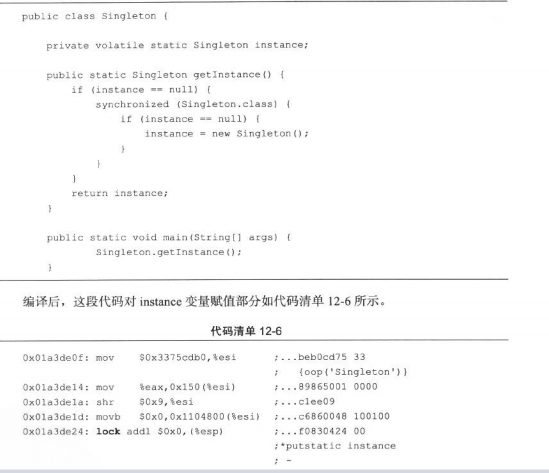

 <h1> java虚拟机</h1>
 <h2>java基础</h2>
 <h3> （一）基本概念</h3>
java 虚拟机在执行java程序的过程中会把它所管理的内存划分为若干个不同的数据区域


  1. <h4>方法区(线程共享)</h4>

      1. 和堆一样，是各个线程共享的内存区域，它用于存储已被虚拟机加载的类信息、常量、静态变量、即时编译器编译后的代码等数据。
      2. 规定当方法区无法满足内存分配需求时、抛出 **OutOfMemoryError** 异常
      3. <h5>运行常量池</h5>
          1. class文件中的常量池信息，将在类加载后进入方法区的运行时常量池中存放
          2. 运行时常量池相对于class文件常量池的另外一个特征是动态性，运行期间也可以将新常量放入常量池中。
  2. <h4>堆(线程共享)</h4>

      1. 大多数应用来说，堆是内存中最大的一块，在启动时创建，被所有线程共享，此区域唯一的目的就是存放java对象实例。
      2. 规范规定，所有的对象实例及数组都要在堆中分配（随着发展此规定不绝对）
      3. 堆是垃圾收集器管理的主要区域，由于现代收集器基本都采用分代算法，所以java堆还可以细分为新生代和老年代，再细的还有Eden空间、From Survivor空间、To Survivor空间等。
      4. 规范规定，java堆可以处于物理上不连续的内存空间中，只要逻辑上是连续的即可
      5. 如果在堆中没有内存完成实例分配，并且堆无法再扩展时，会抛出 **OutOfMemoryError** 异常
  3. <h4>虚拟机栈（线程私有）</h4>

      1. java方法执行的内存模型，每个方法再执行的同时会创建一个栈帧用于**存储局部变量表**、**操作数栈**、**动态链接**、**方法出口** 等信息
      2. java虚拟机中，对这个区域规定了两种异常状况
            1.如果线程请求的栈深度大于虚拟机所允许的深度，则抛出 **StackOverflowError** 异常 。目前看的话，主要原因有以下几种：

                  1. 有递归调用，且递归层级过深;
                  2. 执行大量方法，导致栈空间耗尽;
                  3. 方法内声明了海量的局部变量;
                  4. 数组、List、map数据是否过大;

            2.如果虚拟机栈可以动态扩展（现在估计应该都是可以的），如果扩展时无法申请足够的内容，就会抛出**OutOfMemoryError**异常。目前看的话就是内存被耗空了，需要dump日志查看，排查原因。
  4. <h5>本地方法栈(线程共享)</h5>
      本地方法栈与虚拟机所发挥的作用是非常相似的，区别是虚拟机栈执行java方法，而本地方法栈则为虚拟机使用到的Native方法（java调用非java代码的接口）服务。
  5. <h5>程序计数器（线程私有）</h5>
      1. 为了线程切换后，能记录原有线程执行位置的区域
  6. <h5>直接内存</h5>

      jdk1.4中新加入了NIO类，引入了基于通道和缓冲区的I/O方式，它可以使用Native函数库直接分配堆外内存，这部分内存收到物理主机限制，如果配置不得当，使这部分区域的内存过高，超过了物理主机限制，也会导致**OutOfMemoryError**异常。

<h3> （二）对象的创建</h3>

1. <h4>内存空间的分配</h4>

    1. 指针碰撞：如果堆内存是整齐的，分配内存的方式就是把指针挪动一段与对象大小相等的距离
    2. 空闲列表：如果堆内存不是整齐的，虚拟机就要维护一个对象空闲列表（记录哪些内存是可以使用的），分配内存的时候就在这个表上找空间
    3. 本地线程分配缓冲（TLAB）：虚拟机为了保证分配操作的原子性，采用CAS加失败重试，或者是吧内存分配的动作按照线程划分在不同的空间中进行，即每个线程在java堆中先分配一小块内存，只有线程上的内存用完并要分配新的内存时，才需要同步锁定
2. <h4>内存空间的分配</h4>

    1. 对象头
        1) 对象头分为两部分信息，第一部分存储对象自身的运行时的数据，如哈希码、GC分代年龄、锁状态标志、线程持有的所、偏向线程ID、偏向时间戳等。
        2) 对象头的另一部分是类型指针，即对象指向它的类元数据的指针，虚拟机通过这个指针来确定这个对象是哪个类的实例。如果对象是一个数组，那在对象头中还有一块用于记录数组长度的数据。
    2. 实例数据
        实例数据时对象真正粗出的有效信息，无论是在父类继承还是子类中定义的，都会被记录下来。
    3. 对齐填充
        仅仅起占位符作用，java虚拟机要求对象大小必须是8字节的整数倍，当实例没有对齐的时候，就需要通过对齐来补全。

<h3> （三）对象的访问定位</h3>

目前主流的方式是1：使用句柄，2：直接指针

使用句柄，需要在java堆中划分出一块内存来作为句柄池，一个句柄包含了对象示例数据与类型数据各自的地址信息，最大好处就是存储的是稳定的句柄地址，在对象被移动时只会改变句柄中的实例数据指针


使用直接指针访问，java堆对象的布局就必须考虑如果放置访问类型数据的相关信息，好处就是速度更快，节省了一次指针定位的时间开销。

<h2>垃圾收集器与内存分配策略</h2>
  <h3> （一）判断对象是否死亡的算法 </h3>
    <h4> 1. 引用计数器算法</h4>

      给对象添加一个引用计数器，每当一个地方引用时就+1，引用失效的时候就-1，任何时刻计数器为0的对象就是不可能再被使用的。

      问题是很难解决对象之间相互循环引用的问题
  <h4> 2. 可达性分析算法</h4>


基本思路就是通过一系列成为"GC Roots" 的对象作为起始点，从这些节点开始向下搜索，搜索走过的路径称为引用链，当一个对象到GC Roots 没有任何的引用链相连时，则证明这个对象是不可用的。图中 5、6、7 虽然互相有关联，但是这三个到GC Roots是不可达的，所以他们会被判定为可回收对象。
<h3> （二）引用的概念 </h3>
  强引用
  软引用
  弱引用
  虚引用

  遗留问题：1：什么是强引用，我们如果new Object() 是强引用，强引用是怎么实现的，实现那些接口的就是其他引用？
           2：强引用是什么时候被回收的，当 线程 的new Object() 超出了自己的作用域， 我们并没有将对象设置为null，垃圾回收器是怎么知道的这个对象是否要回收
           3：软、弱、虚三种引用在实际项目中是否在使用


<h3> （三）回收方法区 </h3>
  永久代的垃圾收集主要回收两部分内容：废弃常量和无用的类。
  废弃常量：当一个常量没有被任何对象引用到的时候，这个常量就会被系统清理出常量池
  无用的类：1）该类的所有实例都已经被回收，堆中不存在该类的任何实例
           2）加载该类的ClassLoader已经被回收
           3）该类对应的java.lang.Class 对象没有任何地方被引用，无法再任何地方通过反射访问该类的方法
  虚拟机对满足了上述三个条件的类可以进行回收（不是必回收）可以指定jvm参数控制


<h3> （四）垃圾收集算法</h3>
  <h4>（1）标记-清除算法</h4>

  
  最基础的算法，算法分为标记、清除两个阶段。
  首先标记出所有需要回收的对象，在标记完成后进行统一回收。
  **主要不足之处在于：1）效率问题，标记和清除两个过程的效率都不会很高。2）清除后会产生大量不连续的内存碎片，如果后续有大对象要分配的时候比如数组，当空间不够的时候会提前触发GC 或爆出OOM异常**
  <h4>（2）复制算法</h4>

  
  复制算法将内存分为大小相同的两块，每次只使用一块，当一块用完了之后，将这块内存中还存活的对象复制到另外一块内存，然后将原来的内存整个清理掉。
  **主要不足之处是：将内存分为两块的方法，代价过高，如果存活对象过多会导致复制时间增加，导致效率降低**
  <h4>（3）标记-整理算法</h4>

  
  标记-整理与标记-清除算法近似，但后续步骤不是直接对可回收对象进行整理，而是让所有存活的对象向一端移动，然后直接清理掉端边界以外的内存。
  <h4>（4）分代收集算法</h4>
  当前商业虚拟机都采用分代收集算法，这种算法只是根据对象存活周期的不同将内存划分为几块，一般是把堆内存分为老年代和新生代，根据各个年代采用最适当的收集算法，在新生代中，每次垃圾收集时都有大量的对象死去，只有少量存活，就采用复制算法，老年代中因为对象存活率高，就采用“标记-清除”或“标记-整理”算法进行回收。
  <h4>（5）枚举根节点</h4>
  可达性分析在执行时必须在一个能确保一致性的快照中进行，这个要求java中对象的引用关系不能发生变化，这时候会导致回收过程中 stop the world。当stop the world 发生时，虚拟机通过 OopMap 实现直接得知哪些地方存放着对象引用。
  <h4>（6）安全点</h4>
  在 OopMap 的协助下，虚拟机可以快速准确的完成GC Roots 枚举，但是因为空间限制， 不能为每一条指令都生成OopMap ，只在特定的位置记录了信息，这个位置叫做安全点。线程只能在运行到安全点时，才能进行暂停。
  GC发生时，有两种方式让所有线程都跑到最近的安全点上再停下来：抢先式和主动式。
  抢先式：所有的线程都先暂停，当发现有线程暂停的地方不在安全点时，恢复线程，让线程跑到安全点再暂停
  主动式：线程在执行时，每当线程执行至安全点时，去查询中断标志是否为真，为真的时候就自己暂停。
  <h4>（7）安全区域</h4>
  线程执行到安全区域时，标识自己进入了安全区域，当离开安全区域时，检查中断标志是否为真，为真则暂停，不为真则继续，目的是当线程在sleep状态或者Blocked状态，无法走到安全点进行挂起时提供线程暂停。
  <h3> （五）垃圾收集器</h3>

  
  hotspot中使用的7种作用于不同分代的收集器，如果两个收集器之间存在连线，说明他们可以搭配使用，

  <h4>（1）Serial 收集器</h4>

  1. Serial收集器是一个单线程收集器，新生代采取"复制"算法，老年代采取"标记-整理"算法，在它进行垃圾收集的时候们必须暂停其他所有的工作线程，直至收集结束。
  2. 优点：简单高效，对于单个CPU环境来说，由于没有线程交互的开销，收集新生代几十到一两百兆的内容只需要几十毫秒到一百毫秒以内。
  <h4>（2）ParNew 收集器</h4>

  1. ParNew收集器是Serial的多线程版本，除了使用多条线程进行垃圾收集之外，其他和Serial一模一样。
  2. 目前只有它能和CMS收集器配合工作
  <h4>（3）Parallel Scavenge 收集器</h4>

  1. Parallel Scavenge 收集器是一个新生代收集器，采用复制算法，并行(多条垃圾收集器并行工作，此时用户线程处于等待状态)多线程处理器。
  2. 特点：关注点与其他收集器不同，CMS等收集器主要关注尽可能缩短垃圾收集时用户线程停顿的时间，而Parallel Scavenge 收集器的目的是达到一个可控制的吞吐量（吞吐量= 运行用户代码时间/（运行用户代码时间+垃圾收集时间））

  <h4>（4）Serial old 收集器</h4>

  1. Serial 收集器的老年代版本，单线程工作，采用"标记-整理"算法。
  2. 主要使用与Client模式下的虚拟机使用。
  3. Server模式下用途：1：作为CMS收集器的后备预案，2：在并发收集发生Concurrent Mode Failure时使用。
  <h4>（5）Parallel Old 收集器</h4>

  1. Parallel Old 收集器是Parallel Scavenge 收集器 的老年代版本，使用"标记-整理"算法，并行多线程处理。
  <h4>（6）CMS收集器</h4>

  1. CMS收集器 是一种以获取最短回收停顿时间为目标的收集器。使用"标记-清除"算法。
  2. 运作过程分为4个步骤：1——》初始标记 2——》并发标记 3——》重新标记 4——》并发清除。
  3. 其中：初始标记、重新标记这两个步骤需要 "Stop The World"。
  4. 初始标记仅仅只是标记一下GC Roots能直接关联到的对象，速度很快。
  5. 并发标记阶段就是进行GC Roots Tracing的过程。
  6. 重新标记阶段是为了修正并发标记因用户程序继续运作而导致标记产生变动的那一部分对象的标记记录，这个阶段会比初始阶段稍长一点，但远比并发标记的时间段。
  7. 整个过程中耗时最长的并发标记和并发删除过程都是可以和用户线程一起工作的，
  8. 优点：并发收集、低停顿
  9. 缺点：对CPU资源敏感、无法处理浮动垃圾（程序运行过程中在标记过后出现的垃圾）、基于"标记-清除"算法，空间碎片过多时，会给大对象分配带来很多麻烦，有可能会导致提前触发一次Full GC。
  <h4>（7）G1 收集器</h4>

  G1收集器是面向服务端应用的垃圾收集器，特点是
  1. 并行与并发，能充分利用多CPU、多核环境下的硬件优势，缩短Stop The World的停顿时间，其他收集器要停顿java线程执行的GC动作，G1收集器仍然可以通过并发的方式让java程序继续执行。
  2. 分代收集，采用不同的方式去处理各种对象，实现更好的收集效果
  3. 空间整理：与CMS的"标记-清理"算法不同，G1整体是基于"标记-整理"算法实现。从局部看是基于"复制"算法实现，从算法看，G1收集器不会产生内存空间碎片。
  4. 可预测的停顿，降低停顿是G1和CMS的共同关注点，G1可以建立可预测的停顿时间模型，能让使用者明确指定在一个长度为M毫秒的时间段内，消耗在垃圾收集器上的时间不得超过N毫秒。

  使用G1收集器的时候，java堆内存被划分为多个大小相等的独立区域，虽然仍然保留了新生代和老年代的额概念，但是新生代和老年代不再物理隔离。
  之所以G1能建立可预测的停顿时间模型，是因为它可以有计划的避免在整个java堆中进行全区域的垃圾收集，跟踪各个块里的垃圾堆积的价值大小，在后台维护一个优先列表，每次根据允许的收集时间，优先回收价值最大的区域。保证了G1收集器在有限时间内可以获取尽可能搞得收集效率。

  G1收集器的运作可以大致划分为以下几个步骤：
  1. 初始标记
    初始标记仅仅是标记一下GC Roots能直接关联到的对象并且修改TAMS的值，让下一阶段用户程序并发运行时能在正确可用的Region中创建新对象，这个阶段需要停顿线程，但是耗时很短
  2. 并发标记
    并发标记是从GC Root开始堆堆终对象进行可达性分析，找出存活的对象，这个阶段耗时较长，但是可以和用户程序并发执行
  3. 最终标记
    最终标记是为了修正在并发期间因用户程序继续运作而导致标记产生变动的那一部分标记记录，虚拟机会把这部分数据放在一个列表中，最终标记就是将这个列表中的数据合并到删除列表中，这阶段需要停顿线程，但是可并行执行。
  4. 筛选回收
    筛选回收阶段首先堆各个Region的回收价格和成本进行排序，根据用户期望的GC停顿时间来制定回收计划。
  <h3>（六）理解GC日志</h3>

  ```
  33.125：[GC[DefNew：3324K-＞152K（3712K），0.0025925secs]3324K-＞152K（11904K），0.0031680 secs]
  100.667：[Full GC[Tenured：0K-＞210K（10240K），0.0149142secs] 4603K-＞210K（19456K），[Perm：2999K-＞2999K（21248K）]，0.0150007 secs][Times：user=0.01 sys=0.00，real=0.02 secs]
  ```
举例：
    33.125：[GC[DefNew：3324K-＞152K（3712K），0.0025925secs]3324K-＞152K（11904K），0.0031680 secs]

  1. "33.125"和"100.667" 说明GC发生的时间，这个是从java虚拟机启动以来的秒数
  2. "[GC"和"[Full GC" 说明这次垃圾收集的停顿类型 如果有Full 说明是发生了Stop The World的
  3. "DefNew"、"Tenured"、"Perm"表示GC发生的区域，这个与垃圾收集器相关，如果是ParNew收集器，显示为"ParNew",如果使用Serial收集器，显示为"DefNew"
  4. "3324K-＞152K（3712K）"含义是 ：GC前该内存的已使用容量，->GC后该内存区域已使用容量(该内存区域总容量) "4603K-＞210K（19456K）" 表示：GC前java堆已使用容量->GC后java 堆已使用容量(java 堆总容量)
  5."0.0031680 secs" 表示该内存区域GC所占用的时间，单位是秒。
  <h3>（七）内存分配</h3>

  大多数情况下，对象在新生代Eden区中分配，当Eden区没有足够空间进行分配时，虚拟机将发生一次Minor GC
  大对象直接进入老年代，写程序时应当避免创建短命的大对象。
  长期存活的对象将进入老年代，对象出生并经过第一次Minor GC后仍然存活，并且能被 Survivor容纳的话，将被移动到Survivor空间中，并且对象年龄设置为1，对象在Survivor区中每经过一次Minor GC 年龄就增加一岁，当年龄达到阈值时（默认15） 就会被放入老年代中。
  如果Survivor空间中相同年龄所有对象大小的总和占 Survivor 空间的一半，年龄大于等于该年龄的对象就可以直接进入老年代，无需等到参数设置的年龄
  <h4>空间分配担保机制</h4>

  空间分配担保机制：发生Minor GC 之前，虚拟机会先检查老年代最大可用的连续空间是否大于新生代所有对象总空间，如果这个条件成立，那么Minor GC是安全的。如果不成立，则首先看参数设置值是否允许担保失败，如果允许，那么会继续检查老年代最大可用的连续空间是否大于历次晋升到老年代对象的平均大小，如果大于，将尝试进行一次Minor GC 尽管这次是GC是有风险的，如果小于或者参数设置为不允许，那这是会进行一次Full GC

  上述的风险来源于新生代采取了复制算法（使用一个 Survivor 空间来做轮换备份），如果发生极端情况（内存回收后新生代的所有对象的是存活的），就需要老年代做担保，把Survivor无法容纳的对象直接进入老年代，前日是老年代还有足够的剩余空间。会有多少对象在本次GC后存活下来的数量未知，所以只好取之前每一次回收经省道老年代对象的容量的平均值作为参考，决定是否进行Full GC 来让老年代腾出更多空间。

 <h2>虚拟机执行子系统</h2>
 <h4> Class 文件的结构 </h4>
  class文件是一组以8位字节为单位的二进制流，各个数据项目按照顺序紧凑的排列在Class文件中，中间没有任何的分隔符。当遇到需要占用8位字节以上空间的数据项时，则会按照高位在前的方式分割成若干个8位字节进行存储。

  1. 每个class文件的头4个字节称为魔数，作用是确定这个文件是否为一个能被虚拟机接受的class文件，为0xCAFEBABE
  2. 紧接着的4个字节存储的是版本号
  3. 版本号之后是常量池入口，可以理解为class文件的资源仓库。
      1. 由于常量池的数量不固定，在常量池入口有一个u2类型的数据，代表常量池的计数池
      2. 常量池中主要存放两大类常量：字面量和符号引用，字面量比较接近于java语言层面的常量概念，包括了下面三类常量：
          1. 类的接口和全限定名
          2. 字段的名称和描述符
          3. 方法的名称和描述符

      java代码在进行编译的时候，是在虚拟机加载class文件的时候进行动态连接，也就是说在class文件中不会保存各个方法、字段的最终内存布局信息，因此这些字段、方法的符号引用不用经过运行期转换的话无法得到真正的内存入口地址，也就无法直接被虚拟机使用。
      当虚拟机运行时，需要从常量池获得对应的符号引用，在类创建时或运行时解析、翻译到具体的内存地址之中。
      上述信息简化后是：java在编译的时候其实不知道各个方法字段的信息，只会知道个名字，具体知道的时候是在类创建的时候去解析的。
  4. 常量池结束后，紧接着的两个字节代表访问标志。这个标志用于识别一个类或者接口的访问信息，就是java中的private或者public 或final等修饰词的设置存放的地方
  5. 访问标志后是类索引、父类索引和接口索引
      1. 类索引和父类索引都是一个u2类型的数据，而接口索引集合是一组u2类型的数据的集合，class文件中由这三项数据来确定这个类的继承关系
      2. 由于java语言不允许多继承，所以父类索引只有一个，除了java.lang.Object外，所有的java类的父类索引都不为0
      3. 接口索引集合就是用来描述这个类实现了那些接口，这些被实现的接口将按 implements 后的顺序从左到右排列在接口索引集合中

  6. 字段表集合，是用于描述接口或者类中声明的变量。字段包括类级变量以及实例级变量，但不包括在方法内部声明的局部变量。字段表集合就是通过位存储的字段的属性（作用域修饰词、是否static、是否final等）
  7. 方法表集合，与字段表集合几乎一致
  8. 属性表集合
      1. 对于每个属性，他的名称需要从常量池中引用一个类型的常量来表示，而属性值的结构则是完全自定义的，只需要一个u4的长度去说明属性所占用的位数即可
      2. code属性，java程序方法体中的代码经过javac编译器出库后，最终会变为字节码指令存储在code属性内。code属性出现在方法表的属性集合之中，但并非所有的方法表都必须存在这个属性，例如接口或抽象类中的方法就不存在code属性。
      3. 如果把一个java程序中的信息分为代码和元数据（字段、方法的定义和其他信息），在整个class文件中，code属于描述代码，所有其他数据项目都用于描述元数据。
 <h3> 字节码指令 </h3>
  <h4> 字节码指令简介 </h4>
  java虚拟机的指令是由一个字节长度的、代表着某种特定操作含义的数字，以及跟随其后的零至多个代表此操作所需参数而构成。
  由于java虚拟机采用面向操作数栈而不是寄存器的结构，所以大多数的指令都不包含操作数，只有一个操作码。
  字节码指令集是一种具有鲜明特点、优劣势都很突出的指令集架构，由于限制了java虚拟机操作码的长度为一个字节，这意味着指令集的操作码总数不可能超过256条，又由于class文件放弃了编译后代码的操作数长度对齐，这就意味着虚拟机处理那些超过一个字节的数据的时候，不得不在运行时从字节中重建出具体数据的结构，如果要将一个16位长度的无符号整数使用两个无符号字节存储起来，那么他们的值是 (byte << 8) | byte2。这个操作在魔偶种程度上会导致解释执行字节码时损失一些性能，但优势也非常明显，放弃了操作数长度对齐，就意味着可以省略很多填充和间隔符，用一个字节来代表操作码，也是为了尽可能的获得短小精悍的编译代码，这种追求尽可能小数据量、高传输效率的设计是由java语言设计之初面向网络、智能家电的技术背景所决定的，并一直沿用至今。
  <h4> 字节码与数据类型 </h4>
    在java虚拟机的指令集中，大多数的指令都包含了其操作所对应的数据类型信息、
    例如iload指令用于从局部变量表中加载int类型的数据到操作数栈中，而fload指令加载的则是float类型的数据。这两条指令的操作在虚拟机内部可能会由同一段代码实现，但是在class文件中他们必须拥有各自独立的操作码。
  <h4> 字节码的类型 </h4>
    字节码可大致被分为9类
    <h5> 加载和存储指令 </h5>用于将数据在栈帧中的局部变量表和操作数栈
    <h5> 运算指令 </h5>用于对两个操作数栈上的值进行某种特定运算，并把结果重新存入到操作栈顶。
    <h5> 类型转换指令 </h5>可以将两种不同的数据类型进行相互转换，一般用于实现用户代码中的显式类型转换操作。
    <h5> 对象创建与访问指令 </h5>类实例和数据的创建的指令
    <h5> 操作数栈管理指令 </h5>直接操作操作数栈的指令
    <h5> 控制转移指令 </h5>可以让java虚拟机有条件或无条件的从指定的位置指令而不是控制转移指令的下一条指令继续执行程序
    <h5> 方法调用和返回指定 </h5> 方法调用、分派、返回指令
    <h5> 异常处理指定 </h5> 程序中显示抛出异常的操作
    <h5> 同步指定 </h5>

  支持方法级的同步和方法内部一段指令序列的同步，都是使用管程（Monitor）来支持的。
  方法级的同步是隐式的，即无需通过字节码指令来控制，它实现在方法调用和返回操作中。
  虚拟机可以从方法常量池的方法表结构中的ACC_SYNCHRONIZED访问标志得知一个方法是否声明为同步方法。    当方法调用时，调用指令将会检查方法的ACC_SYNCHRONIZED访问标志是否被设置了，如果设置里，执行线程就要求先成功持有管程，然后才能执行方法，最后当方法完成时（无论是正常完成还是非正常完成）释放管程。如果一个同步方法执行期间抛出了异常，并且在方法内部无法处理异常，那么这个同步方法所持有的管程将在异常抛到同步方法之外时自动释放。
  同步一段指令集序列通常是由java语言中的synchronized语句块来表示的，java虚拟机的指令集中由monitorenter和monitorexit两条指令来支持synchronized关键字的语义，正确实现synchronized关键字需要javac编译器与javva虚拟机两者共同协作支持。
  
  <h4> 公有设计和私有实现思想 </h4>
  公有设计：java虚拟机描绘了java虚拟机应有的共同程序存储格式，class文件格式以及字节码指令集。
  私有实现：这些内容与硬件、操作系统级虚体的java虚拟机实现之间是完全独立的。
  <h2>虚拟机类加载机制</h2>

  类加载的时机:类从被加载到虚拟机内存中开始，到卸载出内存位置，它的整个生命周期包括：加载、验证、准备、解析、初始化、使用、卸载7个阶段。其中：验证、准备、解析，这三个阶段统称为链接。
  

  加载、验证、准备、初始化和卸载这5个阶段的顺序是确定的，类的加载过程必须按照这种顺序按部就班的开始，而解析阶段则不一定，在某些情况下可以在初始化阶段之后再开始，这是为了支持java语言的运行时绑定（也成为了动态绑定或者晚期绑定）。
  在上面说按部就班的开始是因为上述阶段通常都是互相交叉混合的进行的，通常会在一个阶段执行的过程中调用、激活另外一个阶段。
  <h4>虚拟机对上述阶段的约束</h4>
  java虚拟机没有强行约束类什么时候加载，交给虚拟机的具体实现来自由把握，但对于初始化阶段，虚拟机规范严格规定了有且只有5中情况不许立即对类进行初始化（加载、验证、准备自然在此之前开始）。

  1. 遇到 new、 getstatic、putstatic或是invokestatic 这4条字节码指令时，如果类没有进行过初始化，则需要先触发其初始化。这4个指令最常见的java代码场景是：new对象、读取或设置一个类的静态字段、调用这个类的静态方法的时候
  2. 使用java.lang.reflect包的方法堆类进行反射调用的时候
  3. 初始化一个类的时候，如果发现其父类还没有初始化则需要先触发其父类的初始化
  4. 虚拟机启动时，用户需要指定一个要执行的主类（包含main方法的类），虚拟机会先初始化这个主类
  5. 使用动态语言支持的时候，如果一个java.lang.invoke.MethodHandle实例最后解析的结果是REF_getStatic、REF_putStatic、REF_invokeStatic的方法句柄，并且这个方法句柄所对应的类没有进行过初始化，则需要先触发其初始化
  <h3>类加载的过程</h3>
  <h4>1 加载</h4>
  加载阶段、虚拟机需要完成以下3件事

  1. 通过一个类的全限定名来获得定义此类的二进制字节流
  2. 将这个字节流所代表的静态存储结构转换为方法区的运行时数据结构
  3. 在内存中生成一个代表这个类的java.lang.Class对象，作为方法区这个类的各种数据的访问入口


  相对于类加载过程的其他阶段，一个非数组类的加载阶段（准确的说是加载阶段获取类的二进制字节流的动作）是开发人员可控性最强的，因为加载阶段既可以使用系统提供的引导类加载器来完成，也可以由用户自定义的类加载器去完成。
  对于数组类而言，情况就有所不同，数组类本省不通过类加载器创建，它是由java虚拟机直接创建的。但是数组类与类加载器仍然有很密切的关系，因为数组类的元素类型最终是要靠类加载器去创建，一个数组类，创建过程就遵循以下规则

  1. 如果数组的组件类型是引用类型，那就递归采用加载过程去加载这个组件类型，数组C将在加载该组件类型的类加载器的类名称空间上被标识
  2. 如果数组的组件类型不是引用类型，java虚拟机将会把数组C标记为与引导类加载器关联
  3. 数组类的可见性与它的组件类型的可见性一致，如果组件类型不是引用类型，那数组类的可见性将默认为public

  加载阶段完成后，虚拟机外部的二进制字节流就按照虚拟机所需的格式存储在方法区之中，方法区中的数据存储格式由虚拟机实现自行定义。
  加载阶段与链接阶段的部分内容是交叉进行的（如一部分字节码文件格式验证动作），加载阶段尚未完成，连接阶段可能已经开始了，但这些夹在加载阶段制动进行的动作，仍然属于连接阶段的内容，这两个阶段的开始时间仍然保持着固定的先后顺序。
  <h4>2 验证</h4>
  验证是连接阶段的第一步，这一阶段是为了确保class文件的字节流中包含的信息符合当前虚拟机的要求，并且不会危害虚拟机自身的安全。
  验证大致分为4个阶段的检验动作：文件格式验证、元数据验证、字节码验证、符号引用验证。

  1. 文件格式验证验证字节流是否符合class文件的规范，并且能被当前版本的虚拟机处理。
      1. 包含是否以魔数0xCAFEBABE开头
      2. 主次版本号是否在当前虚拟机处理范围之内
      3. 常量池中的常量是否有不被支持的常量类型
      4. 指向常量的各种索引值是否有指向不存在的常量或不符合类型的常量
      5. Class文件中各个部分级文件是否有被删除的或附加的其他信息。。。。
      只有通过这个阶段的验证后，字节流才会进入内存的方法区进行存储，所以后面的验证都是基于方法区的存储结构进行的，不会再直接操作字节流

  2. 元数据验证是对字节码描述的信息进行语义分析，以保证其描述的信息符合java语言规范的要求
      1. 这个类是否有父类
      2. 这个类的父类是否继承了不允许继承的类（被final修饰的类）
      3. 如果这个类不是抽象类，是否实现了其父类或接口之中要求实现的所有方法
      4. 类中的字段，方法是否与父类产生矛盾（出现不符合规则的方法重载，例如方法参数都一直，但是返回值类型却不同）
  3. 字节码验证
    这个阶段是最复杂的一个阶段，主要目的是通过数据流和控制流分析，确定程序语义是合法的、符合逻辑的，保证被校验的类的方法再运行时不会做出危害虚拟机安全的事件
      1. 保证任意时刻操作数栈的数据类型与指令代码序列都能配合工作，不会出现操作数栈放置了一个int类型的数据，使用的时候缺按long类型来加载入本地变量表中
      2. 保证跳转指令不会跳转到方法体以外的字节码指令上
      3. 保证方法体重的类型转换是有效的，例如可以吧一个子类对象赋值给父类数据类型，但是不能把对象赋值给一个与它毫无关系，，完全不相关的数据类型。
      由于数据验证的高复杂性，虚拟机设计团队为了避免过多的时间消耗在字节码验证阶段，在jdk1.6之后给方法体的code属性的属性表中增加了一项StackMapTable的属性，描述了方法体中所有的基本块，开始时本地变量表和操作栈应有的状态，在字节码验证期间只需要检查StackMapTable属性中的记录是否合法即可，从而节省时间。
      jdk1.6可以使用jvm参数要求再类型校验失败的时候退回到旧的类型推导方式进行校验。
      jdk1.7之后，对于主版本号大于50的class文件，使用类型检查来完成数据流分析校验是唯一的选择，不允许再退回到类型推导的校验方式。
  4. 符号引用校验
    最后一个阶段的校验发生在虚拟机将符号引用转为直接引用的时候，这个转换动作将在连接的第三阶段---解析阶段中发生，符号引用验证可以看作是对类自身以外的信息进行匹配性校验，通常校验下列内容
      1. 符号引用中通过字符串描述的全限定名是否能找到对应的类
      2. 在指定类中是否存在符合方法的字段描述符以及简单名称所描述的方法和字段
      3. 符号引用中的类、字段、方法的访问性（private、public 等）是否可悲当前类访问
      符号引用验证的目的是缺号解析动作能正常执行，如果无法通过符号引用验证，那么将会抛出java.lang.NoSuchFieldError或java.lang.NoSuchMethodError等。（包冲突会出现此问题）
      如果代码都已反复使用和验证过，可以通过jvm参数来关闭大部分的类验证措施，以缩短虚拟机类加载的时间。
  <h4>3 准备</h4>
  准备阶段是正式为类变量分配内存并设置类变量初始值的阶段，这些变量所使用的内存都将在方法区中进行分配
  这时候进行内存分配的仅包括类变量（被static 修饰的变量），实例变量将会在对象实例化的时候随着对象一起分配在java堆中，这里的初始值一般是数据类型的零值。

  假设有一个类变量定义是
  public static int value = 123;
  在变量value在准备阶段后的初始值是0 而非123.因为这时候尚未开始执行任何java方法，而把value赋值为123的putstatic指令时程序被编译后，存放于类构造器< clinit>()方法之中，所以把value赋值为123的动作在初始化阶段才会执行

  特殊情况是变量定义为
  public static final int value = 123;
  编译时javac会降value生成ConstantValue属性，在准备阶段虚拟机就会根据ConstantValue的设置将value赋值为123.
  <h4>4 解析</h4>
  解析阶段是虚拟机将常量池内的符号引用替换为直接引用的过程。
  符号引用是在class文件中它以CONSTANT_Class_info、CONSTANT_Fielderf_info、CONSTANT_Methodref_info等类型的常量出现
  解析阶段的直接引用和符号引用的关联：

  1. 符号引用：是一组符号来描述所引用的目标，可以是任何形式的字面量，只要使用时能无歧义的定位到目标即可。
  符号引用与虚拟机实现的内存布局无关，引用的目标并不一定已经加载到内存中，各种虚拟机实现的内存布局可以各不相同，但是他们能接收到的符号引用必须是一致的，因为符号引用的字面量形式明确定义在java虚拟机规范的class文件格式中。
  2. 直接引用：是直接指向目标的执政、相对偏移量或是一个能间接定位到目标的句柄。
  直接引用是和虚拟机实现的内存布局相关的，同一个符号引用在不同虚拟机实例上翻译出来的直接引用一般不会相同，如果有了直接引用，那引用的目标必定已经在内存中存在。

  虚拟机实现可以根据需要来判断到底是在类被加载器加载时就对常量池中的符号引用进行解析，还是等到一个符号引用将要被使用的时候再去解析它。
  解析动作主要针对类或接口、字段、类方法、接口方法、方法类型、方法句柄和调用点限定符7类符号引用进行，

  1. 类或接口的解析：假设当前类 D 要把一个从未解析过的符号引用解析为一个类或接口C的直接引用，虚拟机会进行以下3个步骤
      1. 如果C不是一个数组类型，虚拟机会把代表N的全限定名传递给D的类加载器去加载这个类C ，在加载过程中，由于元数据验证、字节码验证的需要，又可能触发其他相关类的加载动作，例如加载这个类的父类或实现的接口，一旦这个加载过程出现任何异常，解析过程就宣告失败
      2. 如果C是一个数组类型，并且数组的元素类型为对象，也就是N的描述符会是java.lang.Integer的形式，那将会按照第一点的规则加载数组元素类型，如果N的描述符如前面所假设的形式，需要加载的元素类型就是java.lang.Integer，接着由虚拟机生成一个代表此数组维度和元素的数组对象。
      3. 如果上面的步骤没有出现任何异常，那么C在虚拟机中实际上已经成为一个有效的类或接口了，但在解析完成之前还要进行符号引用验证，确认D是否具备对C的访问权限，如果发现不具备访问权限，将抛出java.lang.IllegalAccessError异常。
  2. 字段解析：要解析一个未被解析过的字段符号引用，首先会对字段表内class_index 8项中索引的CONSTANT_Class_info 符号引用进行解析，也就是字段所属的类或接口的符号引用，如果在解析这个类或接口符号引用的过程中出现了任何异常，都会导致字段符号引用解析的失败，如果解析成功完成，那将这个字段所属的类或接口用C表示，虚拟机规范要求按照如下步骤堆C进行后续字段的搜索。

      1. 如果C本身就包含了简单名称和字段描述符都与目标相匹配的字段，则返回这个字段的直接引用，查找结束。
      2. 如果C中实现了接口，将会按照继承关系从下往上递归搜索各个接口和它的负借口，如果接口中包含了简单名称和字段描述符都与目标相匹配的字段，则返回这个字段的直接引用，查找结束
      3. 如果C不是java.lang.Object的话，将会按照继承关系从下往上递归搜索其父类，如果在父类中包含了简单名称和字段描述符斗鱼目标想匹配的字段，则返回这个字段的直接引用，查找结束。
      4. 如果都未找到，抛出java.lang.NoSuchFieldError异常。
      5. 如果查找过程中成功返回了引用，将对这个字段进行权限验证，如果发现不具备对字段的访问权限，抛出java.lang.IllegalAccessError异常
  3. 类方法解析：与字段解析一样，也需要先解析出类方法表的class_index 项中索引的方法所属的类或接口的符号引用，如果解析成功，当前类是C，接下来将按下列步骤进行后续的类方法搜索

      1. 类方法好接口方法符号引用的常量类型定义是分开的，如果在类方法表中发现class_index 中索引的C是个接口那就直接抛出java.lang.IncompatibleClassChangeError 异常
      2. 如果通过第一步，在类C中查找是否有简单名称和描述符都与目标相匹配的方法。如果找到直接返回这个方法的直接引用，查找结束。
      3. 在类C的父类中递归查找是否有简单名称和描述符都与目标相匹配的方法，如果有则返回这个方法的直接引用，查找结束。
      4. 在类C实现的接口列表及他们的父接口之中递归查找是否有简单名称和描述符都与目标相匹配的方法，如果存在匹配的方法，说明C是抽象类，查找结束，抛出java.lang.AbstractMethodError异常
      5. 方法查找失败，抛出java.lang.NoSuchMethodError
  4. 接口方法解析：接口方法也需要先解析出接口方法表的class_index 项中索引的方法所属的类或接口的符号引用，如果解析成功，在类C中，虚拟机会按如下步骤进行后续的接口方法搜索

      1. 与类方法解析不同，如果在接口方法表中发现class_index中的索引C是个类而不是接口，直接抛出java.lang.IncompatibleClassChangeError异常
      2. 在接口C中查找是否有简单名称和描述符都与目标相匹配的方法，如果有则返回这个方法的直接引用，查找结束。
      3. 在接口c 的父接口中递归查找，知道java.lang.Object 类位置，看是否有简单名称和描述符都与目标相匹配的方法，如果有则返回这个方法的直接引用，查找结束
      4. 宣告方法查找失败，抛出java.lang.NoSuchMethodError
      5. 由于接口中的所有方法默认都是public的，所以不会抛出java.lang.IllegalAccessError异常

<h4>5 初始化</h4>
  类初始化阶段是类加载过程的最后一步，前面除了加载阶段用户可以通过自定义类加载器参与以外，其余动作完全由虚拟机主导和控制。到了初始化阶段，才开始执行类中定义的java程序代码
  在准备阶段，变量以及赋过一次系统要求的初始值，而在初始化阶段，则根据程序员通过程序指定的助管计划去初始化类变量和其他字段，或者说，初始化是执行类构造器< clinit>() 方法的过程。

  1. clinit()方法是由编译器自动收集类中的所有类变量的赋值动作和静态语句块(static{} 块)中的语句合并产生的，编译器收集的顺序是由语句在源文件中出现的顺序所决定的，静态语句块中只能访问到定义在静态语句块之前的变量，定义在它之后的变量，在前面的静态语句块可以赋值，但是不能访问。
  2. clinit()方法与类的构造函数不同，它不需要显示的调用父类构造器，虚拟机会保证在子类的clinit()方法执行之前，父类的clinit()方法已经执行完成，因此，在虚拟机中第一个被执行的clinit()方法的类肯定是java.lang.Object
  3. 由于父类的clinit()方法先执行，也就意味着父类中定义的静态语句快要优先于子类的变量赋值操作
  4. clinit()方法对于类或接口来说并不是必须的，如果一个类中没有静态语句块，也没有对变量的赋值操作，那么编译器可以不为这个类生成clinit()方法
  5. 接口中不能使用静态语句块，但仍然有变量初始化的赋值操作，因此接口与类一样都会生成clinit()方法，但接口与类不同的是，执行接口的clinit()方法不需要先执行父接口的clinit()方法，只有当父接口中定义的变量使用时，父接口才会初始化，另外接口的实现类在初始化时也一样不会执行接口的clinit()方法
  6. 虚拟机会保证一个类的clinit()方法再多线程环境中被正确的加锁、同步，如果多个线程同时去初始化一个类，那么只会有一个线程去执行这个类的clinit()方法，其他线程都需要阻塞等待，知道活动线程执行clinit()方法完毕，如果在一个类的clinit()方法中由很耗时的操作，就可能导致多个进程阻塞。

  <h3>类加载器</h3>
  虚拟机设计团队把类加载阶段中的“通过一个类的全限定名来获得定义此类的二进制字节流”这个动作放在java虚拟机外部去实现，以便让应用程序自己决定如何去获取所需要的类，实现这个动作的代码模块成为类加载器。
  <h4>类与类加载器</h4>
  类加载器虽然只用于实现类的加载动作，但是它在java程序中起到的作用却远远不限于类加载阶段。对于任意一个类，都需要由加载它的类加载器和这个类本身一同确立其在java虚拟机中的唯一性，每个类加载器都拥有一个独立的类命名空间。
  <h4>双亲委派模型</h4>

  从java虚拟机的角度来讲，只存在两种不同的类加载器，一种是启动类加载器，这个加载器使用C++语言实现，是虚拟机自身的一部分，另一种就是所有其他的类加载器，这些类加载器都由java语言实现，独立于虚拟机外部，并且全部都集成自抽象类java.lang.ClassLoader。
  从java开发的角度看，大部分java程序都会使用到以下3种系统提供的类加载器。

  1. 启动类加载器，这个类加载器负责将放在 java_home\lib 目录中的或者被-Xbootclasspath参数所指定的路径中的，并且是虚拟机识别的类库加载到虚拟机内存中。启动类加载器无法被java程序直接引用，用户在编写自定义类加载器时，如果需要把加载请求委派给引导类加载器，那直接使用null代替即可
  2. 扩展类加载器，这个加载器由sun.misc.Launcher$ExtClassLoader实现，它负责加载 java_home\lib\ext目录中的，或者被java.ext.dirs系统变量所指定的路径中的所有类库，开发者可以直接使用扩展类加载器。
  3. 应用程序类加载器，这个类加载器由sun.misc.Launcher$App-ClassLoader实现，由于这个类是ClassLoader中的getSystemClassLoader()方法的返回值，所以一般也称其为系统类加载器，它复杂加载用户类路径上所指定的类库，开发者可以直接使用这个类加载器，如果应用程序中没有自定义过自己的类加载器，一般情况下这个就是程序中默认的类加载器。

  我们的应用程序都是由这3种类加载器互相配合进行加载的，如果有必要，还可以加入自己定义的类加载器，关系如图所示
  
  图中所展示的类加载器之间的这种层次关系，成为类加载器的双亲委派模型，双亲委派模型要求除了顶层的启动类加载器外，其余的类加载器都应当有自己的父类加载器，这里的类加载器之间的父子关系一般不会以继承的关系来实现，而都是以组合关系来复用父加载器的代码。
  双亲委派模型在jdk1.2期间被引入并广泛应用于之后几乎所有的java程序中，但是它并不是一个强制性的约束模型，而是java设计者推荐给开发者的一种类加载器实现方式，
  双亲委派的工作过程是:如果一个类加载器收到了类加载的请求，它首先不会自己去尝试加载这个类，而是把这个请求委派给父类加载器去完成，每一个层次的类加载器都是如此，因此所有的加载情趣最终都应该传送到顶层的启动类加载器中，只有当父加载器反馈自己无法完成这个家在请求时，子加载器才会尝试自己去加载。
  好处就是java类随着它的加载器一起具备了一种带有优先级的层次关系，例如类java.lang.Object 它存放在rt.jar中，无论哪一个类加载器要加载这个类，最终都是委派给处于模型最顶端的启动类加载器来进行加载，因此Object类在程序的各种类加载器环境中都是一个类，相反，如果没有使用双亲委派模型，由各个类加载器自行去加载的话，如果用户自己写了一个称为java.lang.Object的类，并放在程序的ClassPath中，那系统将会出现多个不同的Object类，java类型体系中最基础的行为也就无法保证。
  双亲委派模型对于保证java程序的稳定运行非常重要，实现都集中在java.lang.ClassLoader的LoadClass()方法中：先检查是否已经被加载过，若没有加载则调用父加载器的loadClass()方法,若父类为空，则默认使用启动类加载器作为父加载器，如果父加载器失败，再调用自己的findClass()方法进行加载。
  <h4>破坏双亲委派模型</h4>
  双亲委派模型主要出现过三次被破坏的情况

  1. 发生在出现双亲委派模型之前，由于双亲委派模型在jdk1.2之后才引入，所以为了向前兼容，jdk1.2 的 java.lang.ClassLoader 添加了一个新的protected 的findClass()方法，用户去继承 java.lang.ClassLoader 的唯一目的就是为了重写 loadClass()方法，因为虚拟机再进行类加载的时候会调用加载起的私有方法loadClassInternal()，而这个方法的唯一逻辑就是去调用自己的classLoad()方法.
  2. 第二次被破坏是由于这个模型自身的缺陷导致，双亲委派很好的解决了各个类加载器的基础类的同一问题（越基础的类由越上层的类加载器所加载），但是如果基础类又要调用回用户代码，例如JNDI服务（JNDI服务，JNDI服务是由启动类加载的，但是JNDI服务会去调用在应用内厂商实现的SPI,如jdbc），但是启动类不认识这些厂商自己实现的代码。
  java引入了线程上下文加载器解决这个问题，这个类加载器可以通过java.lang.Thread类的serContextClassLoaser()方法进行设置，如果创建线程时还未设置，它将会从父线程集成一个，如果在应用程序的全局范围内都没有设置过的话，那这个类加载器就默认是应用程序类加载器，JNDI服务使用这个线程加上下文类加载器去加载所需要的SPI代码，也就是父类加载器请求子类加载器去完成类加载的动作，java所有涉及SPI的加载动作基本上都采用了此方式，如JNDI，JDBC，JAXB等
  3. 第三次是由于用户对程序动态性的追求导致的，也就是热部署。目前业内标准是OSGi，OSGi实现模块化热部署的关键是它自定义的类加载器机制的实现，每一个程序模块都有一个自己的类加载器，当需要更换模块式，就把模块和类加载器一起换掉以实现代码的热替换。
  在OSGi环境下，类不在是双亲委派的树状结构，而是进一步发展为网状接口，在收到类加载请求时，OSGi的搜索顺序如下
      1. 将以java.*开头的类委派给父类加载器机器在
      2. 否则将委派列表名单内的类委派给父类加载器加载
      3. 否则将Import列表中的类委派给Export这个类的模块的类加载器加载
      4. 否则查找当前模块的classPath，使用自己的类加载器加载
      5. 否则，查找类是否在自己的Fragment 模块中，如果在，则委派给Fragment 模块的类加载器加载
      6. 否则查找Dynamic Import列表的模块，委托给对应模块的类加载器加载
      7. 否则类加载器加载失败
  上面除了开头两点符合双亲委派规则，其余的类查找都是在平级的类加载器中进行加载的
    **弄懂OSGi的实现，就可以算是掌握了类加载器的精髓**
  <h2>虚拟机字节码执行引擎</h2>

  在不同的虚拟机实现里面，执行引擎在执行java代码的时候可能会有解释执行（通过解释器执行）和编译执行（通过即时编译器产生本地代码执行）两种选择，也可能两者都有，甚至还可能会包含几个不同级别的编译器执行引擎，但从外面看，所有的java执行引擎都是一致的，即**输入字节码文件，处理过程是字节码解析的等效过程，输出的是执行结果**
<h3>运行时栈帧结构</h3>

栈帧是用于支持虚拟机进行方法调用和方法执行的数据结构，它是虚拟机运行时数据区中的虚拟机栈的栈元素，栈帧存储了方法的局部变量表，操作数栈，动态连接和方法返回地址等信息。**每一个方法从调用开始至执行完毕的过程，都对应着每一个战争在虚拟机栈里面从入栈到出栈的过程。**

在程序编译的时候，栈帧需要多大的局部变量表、多深的操作数栈都已经完全确定了，并且写入到方法表的code属性之中，因此一个栈帧需要分配多少内存， 不会收到程序运行期变量数据的影响，而仅仅取决于具体的虚拟机实现。

一个线程中的方法调用链可能会很长，很多方法都同时处于执行状态，对于执行引擎来说，在活动线程中，只有位于栈顶的栈帧才是有效的，称为当前栈帧，与这个栈帧相关联的方法称为当前方法，执行引擎运行的所有字节码指令都只针对当前栈帧进行操作。


<h4>局部变量表</h4>

局部变量表是一组变量值存储空间，用于存放方法参数和方法内部定义的局部变量，在java程序编译为class文件时，就在方法的code属性的max_locals数据项中确定了该方法需要分配的局部变量表的最大容量。
局部变量表的容量以变量槽（Solt）为最小单位，一个solt可以存放32位以内的数据类型，对于64位的数据类型，虚拟机会以高位对齐的方式为其分配两个连续的solt空间。

32位的数据类型boolean、byte、char、short、int、float、reference(一个对象的引用地址)、returnAddress(指向一个字节码的地址,很少使用)
64位的数据类型只有long和double两种。

虚拟机通过索引定位的方式使用局部变量表，索引的范围是从0开始至局部变量表最大的solt数量，如果访问32位的数据，索引n就代表使用第n个solt，如果访问64位的数据类型的变量，会同时使用n个n+1两个slot，不允许单独使用一个solt的索引访问，虚拟机规范中要求如果出现此类访问应在类加载时的校验阶段抛出异常。

方法在执行时，虚拟机是使用局部变量表完成参数值到参数变量列表的传递过程的，如果执行的是实例方法（非static方法），那局部变量表中第0位索引的slot默认是用于传递方法所属对象实例的引用，在方法中可以通过“this” 来访问到这个隐含的参数，其余参数则按照参数列表顺序排列，占用从1开始的局部变量slot，参数列表分配完毕后，再根据方法体内部定义的变量顺序和作用域分配其余的slot。
为了尽可能的节省栈帧空间，局部变量表的slot是可以重复使用的，方法体重定义的变量，其作用域并不一定会覆盖整个方法体，如果当前字节码pc计数器的值已经超出了某个变量的作用域，那这个变量对应的slot就可以交给其他变量使用，不过，这样的设计除了节省栈帧空间以外，在某些情况下会影响到系统的垃圾收集。
```
代码1
public static void main(String[] args) {
        byte[] placeholder = new byte[64 * 1024 * 1024];
        System.gc();
    }
```
代码运行后，并没有进行垃圾回收，原因是在执行System.gc()时，变量 placeholder 还在作用域内，虚拟机自然不能回收placeholder 的内存，修改代码

```
代码2
public static void main(String[] args) {
        {
          byte[] placeholder = new byte[64 * 1024 * 1024];
        }
        System.gc();
    }
```
加入花括号后，placeholder 的作用域被限制在花括号内，但是还是未被垃圾回收
```
代码3
public static void main(String[] args) {
        {
          byte[] placeholder = new byte[64 * 1024 * 1024];
        }
        int a = 0;
        System.gc();
    }
```
此时 placeholder 会被垃圾回收，原因是：局部变量表中的slot没有了 placeholder的引用。
代码2中，System.gc()时，已经离开了 placeholder的作用域，但后续没有任何对局部变量表的操作，placeholder 原本所占用的slot还没有被其他变量服用，所以作为GC Root 一部分的局部变量表仍然保持着对它的关联，这种关联没有被及时打断。
在绝大多数的情况下，影响是很轻微的，但是如果遇到一个方法，其后面代码有一些耗时很长的操作，而前面又定义了占用大量内存，但是实际不会使用的变量，手动将其设置为null也是一种办法。
虽然手动设置为null在某些情况下确实有用，但是不应该有过多的依赖，从编码角度来讲，以适当的变量作用域来控制变量回收时间才是最优雅的解决方法，有时候手动设置为null在JIT编译器后，这一步会被优化掉，所以代码3也可以正确的回收掉内存。
局部变量表不像类变量，会在类加载时有两次赋值（一次准备阶段，赋初始默认值，一次初始化阶段，赋代码中定义的值），如果一个局部变量定义了但是没有赋予初始值时是不能被使用的（即使编译通过，也会在字节码校验的时候被虚拟机发现而导致类的加载失败）。
<h5>操作数栈</h5>
它是一个后入先出栈。同局部变量表一样，操作数栈的最大深度也是在编译的时候写入到code属性中的，操作数栈的每一个元素可以是任意的java数据类型。
当一个方法刚刚开始执行的时候，这个方法的操作数栈是空的，在方法的执行过程中，会有各种字节码指令往操作数栈中写入和提取内容，也就是入栈和出栈操作。
整数加法的字节码指令iadd在执行的时候操作数栈中最接近顶栈的两个元素存入了两个int型的整数，执行iadd指令的时候，会将这两个int值出栈并相加，然后将相加的结果出栈。
<h4>方法调用</h4>
方法调用并不等同于方法执行，方法调用的唯一任务就是确定被调用方法的版本，暂时还不涉及内部具体运行过程。在程序运行中，进行方法调用是最普遍，最频繁的操作，但是class文件的编译过程中不包含传统编译中的链接步骤，一切方法调用在clas文件中存贮的都是符号引用，而不是方法在实际运行时内存布局中的入口地址，这个特性给java带来了更强大的动态扩展能力，但也使java方法调用变得相对复杂，需要在类加载期间，甚至到运行期间才能确定目标方法的直接引用。
<h5>解析</h5>
继续前面的话题，所有方法调用中的目标方法在class文件中都是一个常量池中的符号引用，在类加载的解析阶段，会将一部分符号引用转化为直接引用。
这种解析能成立的掐你是：方法在程序真正运行之前就已经有一个可确定的调用版本，并且不可变。
<h2>晚期（运行期）优化</h2>
在部分商用虚拟机中，java程序最初是通过解释器进行解释执行的，当虚拟机发现某个方法或代码块的运行特别频繁的时候，就会把这些代码认定为“热点代码”，为了提高热点代码的执行效率，在运行时，虚拟机将会把这些代码编译成与本地平台相关的机器码，并进行各种层次的优化，完成这个任务的编译器称为即时编译器。
<h3>HotSpot虚拟机内的即时编译器</h3>
<h4>解释器与编译器</h4>

许多主流的商用虚拟机都同时包含解释器与编译器。解释器与编译器两者各有优势。
当程序需要迅速启动和执行的时候，解释器可以首先发挥作用，省去编译的时间，立即执行。
在程序运行后，随着时间的推移，编译器主键发挥作用，把越来越多的代码编译成本地代码之后，可以获取更高的执行效率。
当程序运行环境中内存资源限制较大，可以使用解释器执行节约内存，反之可以使用编译执行来提高效率。
同时，解释器还可以作为一个编译器激进优化的逃生门，让编译器根据概率选择一些大多数时候都能提升运行速度的优化手段，当优化失败的时候，可以退回到解释状态继续执行。
Hotspot 虚拟机中内置了两个即时编译器。分别称为Client Compiler 和 Server Compiler ,或者简称为c1 编译器和c2编译器，虚拟机会根据自身版本与宿主机的硬件性能自动选择运行模式，也可以强制指定只用某一个编译器或只是用编译器或解释器执行代码。
但是无论是C1或是C2，解释器仍然会在编译无法进行的情况下介入执行过程。

由于即时编译器编译本地代码需要占用程序运行的时间，要编译出优化程度更高的代码，所花费的时间也需要更长，而且想要编译出优化程度更高的代码，解释器可能还要替编译器收集性能监控信息，这对解释执行的速度也会有影响，为了在程序启动响应速度与运行效率之间达到最佳平衡，Hotspot 虚拟机还会逐渐启用分层编译的策略，分层编译的概念在1.6版本被提出，至1.7版本虚拟机中作为默认编译策略被开启，分层编译根据编译器编译、优化的规模与耗时，划分出不同的编译层次，其中包括：

第0层，程序解释执行，解释器不开启性能监控，可触发第1层监控
第1层，也称为C1编译，将字节码编译为本地代码，进行简单，可靠的优化，如有必要将加入性能监控的逻辑
第2层（或2层以上），也称为C2编译，也是将字节码便以为本地代码，但是会启用一些编译耗时较长的优化，甚至会根据性能监控信息进行一些不可靠的激进优化。

实施分层编译后，C1和C2将会同时工作，许多代码都可能会被多次编译，用C1取更高的编译速度，用C2来获取更好的编译质量，在解释执行的时候也无须承担收集性能监控信息的任务。
<h4>编译对象与触发条件</h4>

上文提到过，在运行过程中会被即时编译器的热点代码有两类，一类是被多次调用的方法，另一类是被多次执行的循环体。
对于第一种情况，由于是由方法调用触发的编译，因此编译器理所当然的会以整个方法作为编译对象，这种编译也是虚拟机中标准的JIT编译方式。
而对于后一种情况，尽管编译器动作是由循环体触发的，但是编译器还是会以整个方法作为编译对象，这种编译方式因为编译发生在方法执行过程之中，因此形象的被称为栈上替换，简称OSR编译。

判断一个代码是不是热点代码，是不是需要触发及时编译，这样的行为称为热点探测。目前主流的热点探测判断方式有两种。

基于采样的热点探测：采用这种方法的虚拟机会周期性的检查各个线程的栈顶，如果发现某个方法经常出现在栈顶，那这个方法就是热点方法。好处是简单、高效，还可以很容易的获取方法调用关系。缺点是很难精确的确认一个方法的热度，容易收到线程阻塞或别的外界因素的印象而扰乱热点探测。
基于计数器的热点探测：采用这种方式的虚拟机会为每个方法（甚至是代码块）建立计数器，统计方法的执行次数，如果执行次数超过一定的阈值就认为它是热点方法，这种统计方法实现起来会更麻烦一点，需要为每个方法建立并维护计数器，而且不能直接获取到方法的调用关系，但是它的统计结果相对来说更加的精确和严谨。

在HotSpot虚拟机中使用的是第二种方式，基于计数器的热点探测方法，因此它为每个方法准备了两类计数器：方法调用计数器和回边计数器，在确定虚拟机运行参数的前提下，这两个计数器都有一定的阈值，当计数器超过阈值溢出了，就会触发JIT编译。
方法计数器：这个计数器就是用于统计方法被调用的次数它的默认阈值是在Client模式下1500次，Server模式下10000次，当一个方法被调用时，会先检查改方法是凑存在被JIt编译过的版本，如果存在，则有限使用编译后的本地代码来执行，如果不存在已被编译过的版本，则将此方法的调用计数器+1，然后判断方法调用计数器与回边计数器之和是否超过方法调用计数器的阈值，如果已超过阈值，那么将会向即时编译器提交一个该方法的代码编译请求。

如果不做任何设置，。执行引擎并不会同步等待编译请求完成，而是继续进入解释器按照解释方式执行字节码，知道提交的请求被编译器编译完成。当编译工作完成之后，这个方法的调用入口地址就会被系统自动改成新的调用地址，下一次调用该方法时就会使用已编译的版本。过程如图所示。


如果不做任何设置，方法调用计数器统计的并不是方法被调用的绝对次数，而是一个相对的执行效率，即一段时之内方法被调用的次数。当超过一定的时间限度，如果方法的调用次数仍然不足让他提交给即时编译器编译，那这个方法的调用计数器就会被减少一半，这个过程称为方法调用计数器热度的衰减，而这段时间就称为此方法统计的半衰期。进行热度衰减的动作是在虚拟机进行垃圾收集时顺便进行的。
回边计数器。作用是统计一个方法中循环体代码执行的次数，在字节码中遇到控制流向后跳转的指令称为回边。回边计数器的目的就是为了触发OSR编译。
当解释器遇到一条回边指令时，会先朝招将要执行的diamante片段是否有已经编译好的版本，如果有，他将会优先执行已编译的代码，否则就会将回边计数器的值+1，然后判断方法调用计数器与回边计数器之和是否超过回边计数器的阈值，当超过阈值的时候，将会提交一个OSR编译请求，并且把回边计数器的值降低一些，以便继续在解释器中执行循环，等待编译器输出编译结果。

与方法计数器不同，回边计数器没有计数热度衰减的过程，因此这个计数器统计的就是该方法循环执行的绝对次数，当计数器溢出的时候，它还会把方法计数器的值也调整到溢出状态，这样下次再进入改方法的时候就会执行标准编译过程。
<h4>编译过程</h4>

在默认设置下，无论是方法调用产生的即时编译请求，还是OSR编译请求，虚拟机再代码编译器还未完成之前，都仍将按照解释方式执行，而编译动作则在后台的编译线程中进行。
在后台执行编译的过程中，编译器做了什么事情呢？C1和C2两个编译器的编译过程是不一样的，对于C1来说，它是一个简单快速的三段式编译器，主要关注点在于局部性的优化，而放弃了许多耗时较长的全局优化手段。

第一个阶段，一个平台独立的前端将字节码构造成一种高级中间代码表示：HIR ，HIR使用静态分配的形式来代表代码值，这可以使得一些在HIR的构造过程之中和之后进行的优化动作更容易实现，再次之前编译器会在字节码上完成一部分基础优化，如方法内联、常量传播等优化将会在字节码被构造成HIR之前完成。
第二个阶段，一个平台相关的后端从HIR中产生低级中间代码表示：LIR，而再次之前会在HIR上完成另外一些优化，如空值检查消除、范围检查消除等，以便让HIR达到更高效的代码表示形式。
最后阶段是在平台相关的后端使用线性扫描算法，在LIR上分配寄存器，并在LIR上做窥孔优化，然后产生机器代码。


C2则是专门面向服务端的典型应用并为服务端的性能配置特别调整过的编译器，也是一个充分优化过的高级编译器，几乎能达到GNU C++ 编译器使用 -O2参数的优化强度，它会执行所有经典的优化动作，如无用代码消除、循环展开、循环表达式外提、消除公共子表达式、常量传播、基本快重排序等，还会实施一些与java语言特性密切相关的优化技术，C2的寄存器分配是一个全局着色分配器，它可以充分利用某些处理器架构上的大寄存器集合，以即时编译器的标准来看，C2无疑是比较缓慢的，但是它的编译速度依然远远超过传统的静态优化编译器。
<h4>编译优化技术</h4>

一般来说，即时编译器产生的本地代码回避javac产生的字节码更加优秀。
#### 原始代码 ####
```
static class B{
  int value;

  final int get(){
    return value;
  }
}

public void foo(){
  y= b.get();
  //... do stuff...
  z= b.get();
  sum = y + z;
}
```
#### 内联后代码 ####
```
public void foo(){
  y= b.value;
  //... do stuff...
  z= b.value;
  sum = y + z;
}
```
#### 消除冗余后的代码 ####
```
public void foo(){
  y= b.value;
  //... do stuff...
  z= y;
  sum = y + z;
}
```
#### 复写传播后的代码 ####
```
public void foo(){
  y= b.value;
  //... do stuff...
  y= y;
  sum = y + z;
}
```
#### 无用代码消除后的代码 ####
```
public void foo(){
  y= b.value;
  //... do stuff...
  sum = y + y;
}
```
经过四次优化后，效果是一样的，但是后者比前者省略了许多语句，体现在字节码和机器码指令上的差距会更大，执行效率也会更高。
<h4>公共子表达式消除</h4>
公共子表达式消除的含义是：如果一个表达式E 已经计算过了，并且从先前的计算到现在E中所有变量的值都没有变化，那么E 的这次出现就称为了公共子表达式。对于这种表达式，没有必要花时间再次对它进行计算，只需要直接使用前面计算过的结果代替E就可以了，如果这种优化仅限于程序的基本快内，便成为局部公共子表达式消除，如果这种优化的范围涵盖了多个基本块，那就称为全局公共子表达式消除。
```
int d = ( c * b ) * 12 + a + ( a + b + c );
```
如果这个代码交个javac编译器则不会进行任何优化，完全遵照java源码的写法直译而成
当这段代码进入虚拟机即时编译器后，它将进行如下的优化
```
int d = E * 12 + a + ( a + E );
```
这时，编译器有可能还会进行代数优化，将此优化为：
```
int d = E * 13 + a * 2;
```
<h4>数组边界检查消除</h4>
java是一门动态安全的语言，如果有一个数组foo[]，在java语言访问数组元素foo[i]的时候，系统会自动进行上下界的范围检查，即检查i必须满足i>=0 && i< foo.length这个条件，否则将会抛出数组下标越界异常，对于虚拟机的执行子系统来说，每次数组访问都会带有一次隐含的条件判断操作，对于大量数组访问的代码，也是一种负担。
  数组边界检查是必做的，但是编译器只要通过数据流分析就可以判定循环变量的范围取值永远是在数组范围内的时候，那在整个循环中就可以把数组的上下界检查消除，就可以节省很多次条件判断操作。
  除了数组边界检查这种尽可能把运行期检查提前到编译器完成的思路之外，还有一种就是隐式处理。

  #### 隐式处理前 ####
```
if(foo != null){
  return foo.value;
}else{
  throw new NullPointException();
}
```
#### 隐式处理后 ####
```
try{
  return foo.value;
}catch (segment_falut) {
  throw new NullPointException();
}
```
当foo不为空的时候，对value的访问是不会消耗一次判空的开销的，代价就是foo真的为空的时候，会走异常处理的逻辑，而异常处理的逻辑会比判空代价更高，如果foo经常为空的话，虚拟机会收集到的信息选择最佳的方案
<h4>方法内联</h4>

方法内联是编译器最重要的优化手段之一，除了消除方法调用的成本之外，它更重要的意义是为其他优化手段建立良好的基础。
testInlinc()方法的内部全部都是无用的代码，如果不做内联，后续即时进行了无用代码消除的优化，也无法发现任何的无效代码，因为如果分开来看两个方法的话foo()和testInlinc()两个方法里面的操作都有可能是有意义的
```
public static void foo(Object obj){
  if(obj != null){
    System.out.println("do something");
  }
}

public static void testInlinc(String[] args){
  Object obj = null;
  foo(obj);
}
```
为了解决无法内联（除了静态方法、实例构造器等4种方法，其他方法都是虚方法，虚拟机只有在运行期才能确定调用此方法的哪个版本，编译器无法得知）的情况，引入了“类型继承关系分析（CHA）”的技术，用于确定在目前已加载的类中，某个接口是否有多于一种的实现，某个类是否存在子类，子类是否为抽象类等信息。
编译器在进行内联时，如果是非虚方法，那么直接进行内联就可以了，这时候的内联是有稳定前提保障的，如果遇到非虚方法，则会向CHA查询此方法在当前程序下是否有多个目标可供选择，如果只有一个目标，那也可以进行内联，不过这种内联属于激进优化，需要预留一个逃生门防止失败，如果在程序的后续执行过程中没虚拟机一直没有加载到会令这个方法的接受者的继承关系变化的类，那这个内联优化的代码可以一直使用下去，但是如果加载了导致继承关系发生变化的心累，那就需要抛弃已经编译的代码，退回到解释执行状态，或者重新进行编译。
如果想CHA查询出来的结果是有多个版本的目标方法可供选择，则编译器还将会进行最后一次努力，使用内联缓存来完成方法内联，就是在未发生调用之前，内联缓存状态为空，当第一次调用发生后，缓存记录下方法接受者版本都是一样的，那这个内联还可以一直使用下去，如果发生了方法接受者不一致的情况，就说明程序真正使用了虚方法的多态特性，这是才会取消内联，查找虚方法表进行方法分派。
<h4>逃逸分析</h4>

逃逸分析是目前java虚拟机中比较前沿的优化技术，它与类型集成关系分析一样，不是直接优化代码的手段，而是为其他优化手段提供依据的分析技术。
逃逸分析的基本行为就是分析对象的动态作用域，当一个对象在方法中被定义后，它可能被外部方法所引用，例如作为调用参数传递到其他方法中，称为方法逃逸。升值还有可能被外部线程访问到，譬如赋值给类变量或可以在其他线程中访问的实例变量，称为线程逃逸。
如果能证明一个对象不会逃逸到方法或线程之外，也就是别的方法或线程无法通过任何途径访问到这个对象，则可能为这个变量进行一些高效的优化，例如：
栈上分配：在java虚拟机中，对象创建是在堆空间的，如果确定一个对象不会逃逸出方法之外，那让这个对象在栈上分配内存就可以随着栈帧出栈而销毁，在一般应用中，不会逃逸的局部对象所占的比例很大，如果能使用栈上分配，那大量的对象就会随着方法的结束而自动销毁了，垃圾收集系统的压力会小很多。
同步消除：线程同步本身是一个相对耗时的过程，如果逃逸分析能够确定一个变量不会逃逸出线程，无法被其他线程访问，那这个变量的读写肯定就不会有竞争，堆这个变量试试的同步措施也就可以消除掉。
标量替换：标量是指一个数据已经无法分解成更小的数据来表示了，java中的int、long等数据类型都不能进一步分解，它们就可以被称为标量。相对的，如果一个数据可以继续被分解，那它就称作聚合量，java中的对象就是最典型的聚合量。如果把java的一个对象拆散，根据程序的访问情况，将其使用的成员变量恢复原始类型来访问就叫做标量替换。如果逃逸分析证明一个对象不会被外部访问，并且这个对象可以被拆散的话，那程序真正执行的时候将可能不创建这个对象，而改为直接创建它的若干个被这个方法使用到的成员变量来代替，将对象拆分后，除了可以让对象的成员变量在栈上分配和读写之外，还可以作为后续进一步的优化手段创造条件。
<h3>java与C/C++的编译器对比</h3>

1. 因为即时编译器占用的是用户程序的运行时间，具有很大时间压力，它能提供的优化手段也严重受制于编译成本，如果编译速度不能达到要求，那用户将在启动程序或程序的某部分察觉到重大延迟、这点使得即时编译器不敢随便引入大规模的优化技术，而编译的时间成本在静态优化编译器中并不是主要关注点。
2. java语言是动态的类型安全语言，这就以为这需要由虚拟机来确保程序不会违反语言语义或访问非结构化内存，虚拟机需要时间判断数组是否越界等行为占用了部分时间。
3. java中虽然没有virtual关键字，凡是使用虚方法的频率却远远大于C/C++ 也就意味着即时编译器在进行一些优化时的难度大于C/C++的静态优化编译器
4. java语言是可以动态扩展的语言，运行时加载新的类可能改变程序类型的继承关系，这使得很多全局的优化难以进行，编译器不得不时刻注意并随着类型的变化而在运行时撤销或重新进行一些优化。
5. java语言中对象的内存都是在堆上进行的，只有方法中的局部变量和才能在栈上分配，而C/C++的对象则有多种分配方式，如果可以在栈上分配线程私有的对象，将减轻内存回收的压力。另外C/C++中主要由用户程序代码来回收分配的内存，这就不存在无用对象的筛选过程，因此效率上也比垃圾收集机制要高。

同时java的开发效率高，也因为java语言的动态性，C/C++的优化都是在编译期完成的，以运行期性能监控的优化都无法进行，如频率预测、分支频率预测、裁剪未被选择的分支等也是java编译器的优势。

<h1>java内存模型与线程</h1>
<h2>硬件的效率与一致性</h2>

由于计算机的存储设备与处理器的运算速度有几个数量级的差距，所以现代计算机系统都不得不加入一层读写速度尽可能阶级恩处理器运算速度的高速缓存来作为内存与处理器之间的缓冲，将运算需要使用到的数据复制到缓存中，让运算能快速进行，当运算结束后再从缓存同步回内存之中，这样就无需等待缓慢的内存读写了。

基于高速缓存的存储交互很好的解决了处理器与内存的速度矛盾，但是也为计算机系统带来更高的复杂度，因为它引入了一个新的问题 缓存一致性。
在多处理器系统中，每个处理器都有自己的告诉缓存，而他们又共享同一主内存，当多个处理器的运算任务都涉及同一块主内存区域时，将可能导致各自的缓存数据不一致。为了解决一致性的问题，需要各个处理器访问缓存的时候都遵循一些协议，在读写时要根据协议来进行操作，例如：MSI、MESI、MOSI等。
除了增加高速缓存外、处理器可能会对输入代码进行乱序执行优化，处理器会在计算之后将乱序执行的结果重组，保证该结果与顺序执行的结果是一致的，但并不保证程序中各个语句计算的先后顺序与输入代码中的顺序一致，因此，如果存在一个计算任务依赖另外一个计算任务的中间结果，那么其顺序性并不能靠代码的先后顺序来保证，java虚拟机的即时编译器中也有类似的指令重排序优化、

<h2>java内存模型</h2>

<h3>主内存与工作内存</h3>

java内存模型的主要目标是定义程序中各个变量的访问规则，即在虚拟机中将变量存储到内存和从内存中取出变量这样的底层细节。
java内存模型规定了所有的变量都存储在主内存中，每条现场还有自己的工作内存，线程的工作内存中保存了被该线程使用到的变量的主内存拷贝副本，线程堆变量的所有操作都必须在工作内存中进行，而不能直接读写主内存中的变量，不同线程之间也无法访问对方工作内存中的变量，线程建变量值的传递都需要通过主内存来完成，线程、主内存、工作内存的交互关系如图所示


这里的主内存和工作内存与java的堆、栈、方法区并不是同一个层次的内存划分，两者基本上是没有关系的。
<h3>内存间交互操作</h3>

关于主内存与工作内存之间具体的交互协议，即一个变量如果从主内存拷贝到工作内存、如果从工作内存同步回主内存之间的实现细节，java内存模型定义了以下8中操作来完成，虚拟机实现时必须保证下面提到的每一种操作都是原子的。
1. lock（锁定）：作用于主内存的变量，它把一个变量标识为一条线程独占的状态
2. unlock（解锁）：作用于主内存的变量，它把一个处于锁定状态的变量释放出来，释放后的变量才可以被其他线程锁定。
3. read（读取）：作用于主内存的变量，它把一个变量的值从主内存传输到线程的工作内存中，以便随后的load动作使用。
4. load（载入）：作用于工作内存的变量，它把read操作从主内存中得到的变量值放入工作内存的变量副本中。
5. use（使用）：作用于工作内存的变量，它把工作内存中一个变量的值传递给执行引擎，每当虚拟机遇到一个需要使用到变量的值的字节码指令时执行这个操作。
6. assign（赋值）：作用于工作内存的变量，它把一个从执行引擎接收到的赋值给工作内存的变量，每当虚拟机遇到一个给变量赋值的字节码时执行这个操作
7. store（存储）：作用于工作内存的变量，它把工作内存中一个变量的值传递到主内存中，以便随后的write操作使用。
8. write（写入）作用于主内存的变量，它把store操作从工作内存中的到的变量的值放入主内存的变量中。

如果要把一个变量从主内存复制到工作内存，那就要顺序执行read和load操作  
如果要把变量从工作内存同步到主内存，就要顺序执行store和write操作  
java内存模型只要求上述两个操作必须按顺序执行，而没有保证是连续执行  
也就是说read和load之间、store和write之间是可以插入其他指令的  
如对主内存中的变量a、b进行访问，一种顺序是read a、read b、load b、load a，除此之外，java内存模型还规定了在执行上述8中基本操作必须满足以下规则

1. 不允许read和load、store、write 操作之一单独出现，即不允许一个变量从主内存读取了但工作内存不接受，或者从工作内存发起回写操作但主内存不接受的情况出现
2. 不允许一个线程丢弃它最近的assign操作，即变量在工作内存中改变了之后必须把该变化同步回主内存
3. 不允许一个线程无原因的（没有发生过任何assign操作）把数据的工作内存同步回主内存
4. 一个新的变量只能从主内存中诞生，不允许在工作内存中直接使用一个未被初始化（load或assign）的变量，就是一个变量实施use、store之前，必须执行过了assign和load操作
5. 一个变量在同一个时刻，只允许一条线程对其lock操作，但lock操作可以被同一条线程执行多次，多次执行lock后，只有执行相同次数的unlock操作，变量才会解锁
6. 如果对一个变量执行lock操作，那将会清空工作内存中此变量的值，在执行引擎使用这个变量之前，需要重新执行load或assign操作初始化的值
7. 如果一个变量事先没有被lock操作锁定就不允许使用unlock操作，也不允许去unlock一个被其他线程锁住的变量
8. 对一个变量执行unlock之前，必须先把此变量同步回主内存之中（执行store、write操作）

这8种内存访问操作及上述规定，再加上volatile的一些特殊规定，就已经完全确定了java程序中哪些内存访问操作在并发下是安全的。
<h3>对于volatile型变量的特殊规则</h3>

**当一个变量定义为volatile后，它具备两个特性：** 

第一是保持此变量对所有线程的可见性。这里的可见性是指当一个线程改变了这个变量的值，新值对于其他线程来说是可以立刻得知的。  
由于java中的运算并非是原子操作，导致volatile变量在并发环境下也是不安全的。  
由于volatile变量只能保证可见性，在不符合以下两条规则的运算场景中，我们仍然需要通过加锁来保证操作的原子性。
    
    一、 运算结果并不依赖变量的当前值，或者能够确保的只有单一线程修改变量的值。
    二、 变量不需要与其他状态变量共同参与不变约束

**第二个是禁止指令重排序优化**



关键变化在有volatile修饰的变量加入了lock，这个操作相当于加入了一个内存屏障，只有一个cpu在访问时，并不需要内存屏障，但是如果有两个或两个以上的时候访问同一块内存，且其中有一个在观测另外一个，就需要内存屏障来保证一致性了  

这句指令中的addl $0x0,(%esp) 这个指令就是将 esp寄存器的值加0 （此行为是一个空操作），这个作用就是使本CPU的cache写入内存，该写入操作也会引起别的CPU清空自己的cache，这种操作相当于对cache中的变量做了一次前面介绍的 store和write操作，所以通过这样一个空操作，可以让volatile变量的修改对其他cpu立即可见

<h3>原子性、可见性与有序性</h3>

原子性：由java内存模型来直接保证的原子性变量操作包括 read、load、assign、use、store和write，我们大致可以认为基本数据类型的访问读写是具备原子性的
如果应用场景需要一个更大范围的原子性保证，java内存模型还提供了lock和unlock来满足这种需求，尽管虚拟机未把lock和unlock操作直接开放给用户使用，但是提供了更高级的字节码指令monitorenter和monitorexit来隐式地使用这两个操作，这两个字节码指令反应到java代码中就是同步块，synchronized关键字，因此 在synchronized块之间的操作也具备原子性

可见性：可见性是指当一个线程修改了共享变量的值，其他线程能立即得知这个修改，java内存模型是通过在变量修改后，将新值同步回主内存，
在变量读取前从主内存刷新变量值这种依赖主内存作为传递媒介的方式来实现可见性的，无论是普通变量还是volatile变量都是如此，普通变量与volatile变量的区别是
volatile的特殊规则保证了新值能立即同步到主内存，以及每次使用前立即从主内存刷新，因此，可以说volatile保证了多线程操作时变量的可见性，而普通变量则不能保证这点
除了volatile之外，还有synchronized和final 也能实现可见性。  
synchronized是由对一个变量执行unlock操作之前，必须将此变量同步回主内存中（执行store、write操作），这条规则获得的
final修饰的字段是在构造器中一旦初始化完成，并且构造器没有把this的引用传递出去，那在其他线程中就能看见final的值

有序性：java的有序性可以总结为：如果在本线程内观察，所有的操作都是有序的，如果在一个线程观察另一个线程，所有的操作都是无序的，前半句是指线程内表现为串行的语义，后半句是指令重排序和工作内存与主内存同步延迟的现象
java语言提供了volatile和synchronized两个关键字来保证，线程之间操作的有序性，volatile关键字本身就包含了禁止指令重排序的语义，而synchronized则是由“一个变量在同一时刻只允许一条线程对其进行lock操作”这条规则获得的，这条规则决定了持有同一个锁的两个同步块只能串行的进入

<h3>先行发生原则</h3>

如果java内存模型中所有的有序性都仅仅依靠volatile和synchronized来完成，那么有一些操作会变的很繁琐。 所以提出先行发生原则，先行发生原则判断数据是否存在竞争、线程是否安全的主要依据。
依靠先发性原则，我们可以通过几条规则一揽子的解决并发环境下两个操作之间是否可能存在冲突的所有问题。
先行发生指的是 java内存模型中定义的两项操作之间的偏序关系，如果说操作A先行发生于操作B，其实就是说发生操作B之前，操作A产生的影响能被操作B观察到，“影响”包括修改了内存中共享变量的值、发送了消息、调用了方法等。
例：

    //以下操作在线程A中执行
    
    i=1;
    
    //以下操作在线程B中执行

    j=i;

    //以下操作在线程C中执行

    i=2;
假设线程A的操作“i=1”先行发生于线程B的“j=i”，那么可以确定在线程B的操作后，变量j的值一定等于1，
得出这个结论的依据有两个：一是根据先行发生原则，“i=1”可以被观察到，二是线程C还没登场。
线程A操作结束之后没有其他线程会修改变量i的值。
现在再考虑线程C，我们依然保持线程A、B的先发关系，而线程C出现在线程A和线程B的操作之间，但是线程C与线程B没有先行发生关系，那么j的答案是不确定的，因为线程C对变量i的影响可能会被B观察到，也可能不会，这时候线程B就存在读取到过期数据的风险，不具备多线程安全性。

下面是java内存模型下一些“天然”的先行发生关系，这些先行发生关系无需任何同步器协助就已经存在，可以在编码中直接使用。
如果两个操作之间的关系不在此列，并且无法用下列规则推导出来的话，他们就没有顺序性保障，虚拟机可以对他们随意的进行重排序。

**程序次序规则**：在一个线程内，按照程序代码顺序，书写在前面的操作先行发生于书写于后面的操作。准确的说，应该是控制流顺序而不是程序代码顺序。

**管程锁定规则**：一个unlock操作先行发生于后面同一个锁的lock操作，这里必须强调的是同一个锁，而“后面”是时间上的先后顺序

volatile变量规则：对一个volatile变量的写操作先行发生于后面对这个变量的读操作，这里的“后面”是指时间上的先后顺序。

线程启动规则：Thread对象的start方法先行发生于此线程的每一个动作

线程终止规则：线程中的所有操作都先行发生于对此线程的终止检测，我们可以通过Thread.join()方法结束、Thread.isAlive()的返回值等手段检测线程已终止执行。

线程中断规则：对线程interrupt()方法的调用先行发生于被中断线程的代码检测到中断事件的发生，可以通过Thread.interrupt()方法检测到是否有中断发生

对象终结规则：一个对象的初始化完成，先行发生于它的finalize()方法的开始。

传递性：如果操作A先行发生于B，操作B先行发生于C，那就可以得出操作A先行发生于操作C的结论。

```
private int value;

public void setValue(int value){
    this.value = value;
}

public int getValue(){
    return value;
}
```

假设存在线程A和线程B，线程A先（时间上）调用了setValue(1),然后线程B调用了同一个对象的getValue()，线程B收到的是什么
分析：由于两个方法分别由线程A和线程B调用，所以线程次序规则不生效，由于没有同步块，自然不会发生lock和unlock，所以管程规则不生效，由于value变量没有被volatile关键字修饰，所以volatile规则不生效，后面的线程启动、终止、中断规则和对象终结规则和这里没有关系，也因为没有前面的先行发生规则，所以最后一条也不生效，
结果：我们可以判定尽管时间上A优先于B，但是无法确定B线程的getValue()方法的返回结果，这里的操作不是线程安全的。
解决方法：get、set方法加锁，value变量设置为volatile变量
结论：并发安全问题中不要受到时间顺序的干扰，一切以先发原则为准。

<h3>线程的实现</h3>
实现线程的有3中方式：使用内核线程实现、使用用户线程实现、使用用户线程加轻量级进程混合实现

1. 使用内核线程实现： 
内核线程就是直接由操作系统支持的线程，这种线程由内核来完成线程切换，内核通过操纵调度器（操作系统提供）对线程进行调度，并负责将线程的任务映射到各个处理器上，每个内核线程可以看做内核的一个分身，这样操作系统就有能力同时处理多件事情，支持多线程的内核就叫做多线程内核。
程序一般不回去直接去使用内核线程，而是使用内核线程的高级接口---轻量级进程，由于每个轻量级进程都由一个内核线程支持，因此只有先支持内核线程，才能有轻量级进程，这种轻量级进程与内核之间1:1的关系称为一对一的线程模型。
由于内核线程的支持，每个轻量级进程都成为一个独立的调度单元。即使有一个轻量级进程在系统中阻塞了，也不影响整个进程继续工作，但是轻量级进程也有它的局限性
   1. 由于是基于内核线程实现的，所以各种操作（创建、同步）都需要进行系统调用，而系统调用的代价相对较高，需要在用户态和内核态来回切换
   2. 每个轻量级进程都需要一个内核线程的支持，因此轻量级进程需要消耗一定的内核资源（如内核线程的栈空间），因此一个系统支持轻量级进程的数量是有限制的。
2. 使用用户线程实现
广义上来说，一个线程只要不是内核线程，就可以认为是用户线程， 
狭义上来说是完全建立在用户空间的线程库上，系统线程不能感知到线程存在的实现，
如果程序实现的好，这种线程不需要切换到内核态，因此操作时非常快速且低消耗的，也可以支持规模更大的线程数量，部分高性能数据库就是由用户线程实现的，
使用用户线程的优势和劣势在于不需要系统内核的支援，所有的线程都需要用户程序自己处理，有些问题会非常复杂，甚至无法解决。现在除了特别的一些程序，大部分程序已经启用此方案
3. 使用用户线程加轻量级进程混合实现
混合实现模式中，即存在用户线程，也存在轻量级进程。用户线程还是完全建立在用户空间中，因此用户线程的创建、切换、析构等操作依然廉价并且可以支持大规模并发
而操作系统提供的轻量级进程作为用户线程和内核线程之间的桥梁，这样可以使用内核提供的线程调度功能及处理器映射，并且用户线程的系统调用要通过轻量级进程来完成，大大降低了整个进程被完全阻塞的风险。

<h3>java 线程的实现</h3>
在jdk1.2之前，是使用用户线程实现的，


<br><br><br><br><br><br><br><br><br><br><br><br><br><br><br><br><br>


<br><br><br><br><br><br><br><br><br><br><br><br><br><br><br><br><br>
