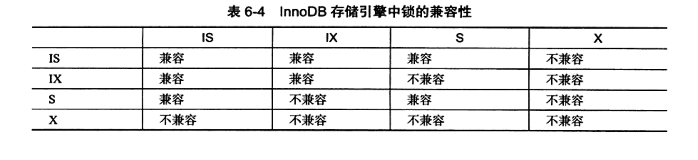

<h1>0 前言</h1>
本书讲述了InnoDB存储引擎的诸多功能和特性，还阐述了如何正确的使用这些功能和特性。

<h1>1 MySQL体系结构和存储引擎</h1>

<h2>1.1 定义数据库和实例</h2>
数据库和实例的定义

数据库：物理操作系统文件或其他形式文件类型的集合，在MySQL数据库中，数据库文件可以是frm、MYD、MYI结尾的文件

实例：MySQL数据库由后台线程以及一个共享的内存区组成，共享的内存可以被运行的后台线程所共享，数据库实例才是真正用于操作数据库文件的。
数据库操作insert、update 等是通过实例操作的

在MySQL中实例与数据库的关系通常是一一对应的，但是也存在集群环境下可能存在一个数据库被多个实例使用的情况。

MySQL被设计成一个单进程多线程架构的数据库，在系统上的表现就是一个进程。

<h2>1.2 MySQL体系结构</h2>


如图所示：MySQL由以下几部分组成

1. 连接池组件
2. 管理服务和工具组件
3. SQL接口组件
4. 查询分析组件
5. 优化器组件
6. 缓冲组件
7. 插件式存储引擎
8. 物理文件

从图中可以看到，MySQL数据库区别于其他的数据库的最重要一个特点就是其插件式的表存储引擎。
MySQL插件式的存储引擎架构提供了一系列标准的管理和服务支持，这些标准与存储引擎本身无关，可能是每个系统必须的。
如SQL分析和优化器等，而存储引擎是底层物理结构的实现，每个存储引擎开发者可以按自己的意愿来进行开发。

需要特别注意的是，存储引擎是基于表的，而不是数据库。


<h2>1.3 MySQL存储引擎 </h2>
MySQL存储引擎是区别于其他数据库的一个重要特性。
存储引擎的好处是，每个存储引擎都有各自的特点，能够根据具体的应用建立不同的存储引擎表。

<h3>1.3.1 InnoDB存储引擎 </h3>
InnoDB存储引擎支持事务，其设计目标主要是面向在线事务处理（OLTP）的应用。
其特点是支持行级锁、支持外键、支持类似oracle的非读定锁（默认读取不会产生锁），MySQL从5.5.8开始后，默认存储引擎为InnoDB。

InnoDB存储引擎将数据放在一个逻辑的表空间中，从MySQL4.1之后它将每个表单独存放在一个ibd文件中。

InnoDB通过多版本并发控制（MVCC）来获得高并发性，并且实现了SQL标准的4个隔离级别，默认为REPEATABLE级别。
同时使用了next-key locking的策略来避免幻读，除此之外，InnoDB还提供了插入缓存、二次写、自适应哈希锁、预读等高性能和高可用的功能。

对于表中数据的存储，InnoDB存储引擎采用了聚集的方式、因此每张表的存储都是按照主键的顺序进行存储的。如果没有主键，InnoDB会为每一行生成一个6字节的ROWID，并以此作为主键。

<h3>1.3.2 MyISAM存储引擎 </h3>
MYISAM 不支持事务、表锁设计、支持全文索引，主要面向一些OLAP数据库应用。
在MySQL5.5.8之前是MySQL的默认存储引擎

MyISAM存储引擎由MYD和MYI组成，MYD用来存放数据文件，MYI用来存放索引文件。


<h3>1.3.3 NDB存储引擎 </h3>

NDB是一个集群存储引擎，类似于oracle的RAC集群。
不过与Oracle的RAC share everything架构不同的是，它的架构是 share nothing的集群架构，因此能提供更高的可用性。
NDB的特点是数据全部都放在内存中（MySQL5.1之后可以将非索引数据放在磁盘上）因此主键查找很快，并且可以通过添加节点线性的提高数据库性能，是高可用，高性能的集群系统。

NDB存储引擎的数据库连接是在MySQL层面完成的，而不是在存储引擎层面完成的，导致复杂查询的连接操作需要巨大的网络开销，所以查询很慢。

<h3>1.3.4 Memory存储引擎 </h3>
Memory存储引擎将表中的数据都放在内存中，如果数据库崩溃或重启，表中的数据都会消失，适合存临时数据的临时表。

Memory存储引擎默认使用哈希索引，而不是B+树索引。

虽然Memory很快，但是还是有一些缺陷，比如：只支持表锁、并发性能差、并且不支持TEXT和BLOB类型，而且存储varchar时，会按char去存储，因此会浪费内存

<h3>1.3.4 Archive存储引擎 </h3>
Archive存储引擎只支持insert和select操作，从MySQL5.1开始支持索引。

Archive存储引擎使用zlib算法将数据行进行压缩后存储，压缩比可达1:10，因此 Archive适合存储归档数据，如日志信息。
Archive存储引擎使用行锁来实现高并发的插入操作，但是其本身不是事务安全的存储引擎，设计目标主要是高速插入和压缩功能。

<h1>2 InnoDB存储引擎 </h1>
InnoDB是事务安全的存储引擎，设计上采用了类似oracle的架构，InnoDB存储引擎是OLTP应用中核心表的首选存储引擎。

<h2>2.1 InnoDB存储引擎的版本 </h2>

| 版本     | 内容                  |
|--------|---------------------|
| 老版本：   | 支持ACID、行锁、MVCC      |
| 1.0.x: | 增加 compress和dynamic |
| 1.1.x: | 增加 linux AIO、多回滚段   |
| 1.2.x: | 增加 全文索引支持、在线索引添加    |


<h2>2.1 InnoDB体系结构 </h2>

图中所示,Innodb存储引擎有多个内存块，可以认为这些内存块组成了一个大的内存池，负责如下工作：

1. 维护所有进程/线程需要访问的多个内部数据结构
2. 缓存磁盘上的数据，方便快速的读取，同时在对磁盘文件数据修改之前在这里缓存
3. 重做日志（redo log）缓冲

后台线程主要作用是负责刷新内存池中的数据，同时保证在数据库发生异常的情况下InnoDB能恢复到正常运行状态

<h3>2.3.1 后台线程 </h3>
InnoDB存储引擎是多线程的模型，因此其后台有多个不同的后台线程，负责处理不同的任务

1. Master Thread

    Master Thread 是一个非常核心的后台线程，主要负责将缓冲池中的数据异步刷新到磁盘，保证数据的一致性，包括脏页的刷新，合并插入缓冲（Insert Buffer）、UNDO页的回收等
2. IO Thread

    在InnoDB存储引擎中大量使用了AIO来处理写IO请求，这样可以极大提高数据库的性能。而IO Thread的工作主要是负责这些IO请求的回调处理。
    
3. Purge Thread
   
   事务被提交后，其所使用的的undolog可能不在需要，因此需要PurgeThread来回收已经使用并分配的undo页，在InnoDB 1.1版本之前，purge操作仅在InnoDB 存储引擎的Master Thread中完成。
   而从InnoDB 1.1版本开始，purge操作可以独立到单独的线程中进行，以此来减轻Master Thread的工作，从而提高CPU使用率及提升存储引擎的性能。


<h3>2.3.2 内存 </h3>
1. 缓冲池
   
   InnoDB是基于磁盘存储的，并将其中的记录按照页的方式进行管理，因此可以将其视为基于磁盘的数据库系统，在数据库系统中，由于CPU速度与磁盘速度之间的鸿沟，基于磁盘的数据库系统通常使用缓冲池技术来提高数据库的整体性能

   缓冲池就是一块内存区域，通过内存的速度来弥补磁盘速度较慢对数据库性能的影响。在数据库中进行读取页的操作，首先将从磁盘读到的也存放在缓冲池中，这个过程称为将也“FIX”在缓冲池中，下次再读取相同的页时，首先判断该页是否在缓冲池中，若在缓冲池中，称该页被缓冲池中被命中，直接读取该页，否则，读取磁盘上的页。

   对于数据库中也的修改操作，则首先修改缓冲池中的页，然后再以一定的频率刷新到磁盘上，这里需要注意的是 **页从缓冲池刷新回磁盘的操作并不是在每次页发生更新时触发，而是通过一种称为Checkpoint的机制刷新会磁盘**

   综上所述，缓冲池的大小直接影响着数据库的整体性能。

   具体来看，缓冲池中缓存的数据页类型有：索引页，数据页、undo页、插入缓冲、自适应哈希索引、InnoDB存储的锁信息、数据字典信息。不能简单的认为，缓冲池只是缓存索引页和数据页和数据页。

   
   从InnoDB 1.0.x开始，允许有多个缓冲池实例，每个页根据哈希值平均分配到不同缓冲池实例中，这样做的好处是减少数据库内部的资源竞争，增加数据库的并发处理能力。
2. LRU List、Free List 和Flush List

   通常来说 数据库中的缓冲池是通过LRU（最近最少使用）算法来进行管理的。即最频繁使用的页在LRU列表的前端，最少使用的页在LRU列表的尾端，当缓冲池不能存放新读取的页时，将首先释放LRU列表中尾端的页。

   lru链表：用来存储内存中的缓存数据。
   free链表：用来存放所有的空闲页，每次需要数据页存储数据时，就首先检测free中有没有空闲的页来分配。
   flush链表：在内存中被修改但还没有刷新到磁盘的数据页列表，就是所谓的脏页列表，内存中的数据跟对应的磁盘上的数据不一致，属于该列表的页面同样存在于lru列表中，但反之未必。

3. 重做日志缓存

   InnoDB的内存区域除了有缓冲池外，还有重做日志缓冲，InnoDB首先将重做日志信息先放入这个缓冲区，然后按一定频率刷新到重做日志文件。重做日志缓存一般不需要设置的很大，一般情况下每一秒都会将重做日志缓存刷新到日志文件，因此用户只需要保证每秒产生的事务量在这个缓冲大小之内即可。

<h3>2.4 Checkpoint技术 </h3>   
页的操作都是在缓冲池中完成的，数据库会定期将新版本的页从缓冲池刷新到磁盘。
   
但是如果每次变化后都立刻刷新进磁盘，数据库的性能就会变差，但是如果时间太长，数据库在此期间内宕机，就会导致部分数据丢失。

为了避免数据丢失的问题，当前事务都采取了 write Ahead log策略，即当事务提交时，先写重做日志，再修改页，当发生宕机导致数据丢失时，通过重做日志来完成数据的恢复。

Checkpoint技术是为了解决以下的问题：
   1. 缩短数据库的回复时间
   2. 缓冲池不够用时，将脏页刷新到磁盘
   3. 重做日志不可用时，刷新脏页

当数据库发生宕机时，数据库不需要重做所有的日志，因为 Checkpoint之前的页都已经刷回磁盘，故数据库只需要对Checkpoint 之后的重做日志进行恢复，打打缩短了恢复的时间。

此外，当缓冲池不够用时，根据LRU算法会溢出最近最少使用的页，这个页就是脏页，那么需要强制执行 Checkpoint ，将脏页刷回磁盘。

重做日志出现不可用的情况是因为当前事务数据库系统对重做日志的设计都是循环使用的，并不是让其无限增大的，这从成本管理上都是比较困难的，重做日志可以被重用的部分是指这些重做日志已经不再需要，即当数据库发生宕机时，数据库恢复操作不需要这部分的重做日志，因此这部分就可以被覆盖重用。此时重做日志还需要使用，那么必须强制产生 Checkpoint ，将缓冲池中的也至少刷新到当前重做日志的位置。

对于InnoDB而言，通过LSN（Long sequence Number）来标记版本的。 LSN是8字节的数字，单位是字节。

在InnoDB中，每次刷新多少页到磁盘、每次从哪里取脏页以及什么时间出发Checkpoint，在存储引擎内部一共有两种，分别为：
1. Sharp Checkpoint
2. Fuzzy Checkpoint

Sharp Checkpoint发生在数据库关闭时所有的脏页都刷新回磁盘，这是默认的工作方式。

Fuzzy Checkpoint 只刷新一部分脏页，而不是刷新所有的脏页回磁盘。在以下几种情况可能出现Fuzzy Checkpoint
1. Master Thread Checkpoint
差不多以每秒或每十秒的速度从缓冲池的脏页列表中刷新一定比例的页回磁盘。这个过程是异步的，此时的InnoDB可以进行其他操作，用户查询线程不会阻塞。

2. FLUSH_LRU_LIST Checkpoint
InnoDB需要保证LRU列表中需要有差不多100个空闲页可供使用，如果空闲页不足100时，InnoDB会将LRU尾部的页移除，如果这些页中有脏页的话，就会进行 Checkpoint

3. Async/Sync Flush Checkpoint
重做日志文件不可用时，需要强制将一些也刷新回磁盘，此时脏页是从脏页列表中选取的。在MySQL 5.6之前，会阻塞用户线程，5.6之后不会阻塞用户线程

4. Dirty Page too much Checkpoint
最后一种是脏页太多，导致InnoDB 强制进行 Checkpoint，是为了保证缓冲池中有足够可用的页。


<h2>2.5 Master Thread </h2>
InnoDB的主要工作都是在一个单独的后台线程 Master Thread中完成的。

<h3>2.5.1 InnoDB 1.0.x之前的 Master Thread </h3>
Master Thread 具有最高的线程优先级别。其内部由多个loop组成：主循环、后台循环、刷新循环、暂停循环。Master Thread 会根据数据库运行的状态在这几种状态中循环。

主循环通过 Thread.sleep()实现，每一秒操作包括：
1. 日志缓存刷新到磁盘，即使这个事务还没有提交（总是）
2. 合并插入缓存（可能）
3. 之多刷新100个InnoDB的缓冲池中的脏页到磁盘（可能）
4. 如果当前没有用户活动，则切换到background loop（可能）

每10秒的操作包括：
1. 刷新100个脏页到磁盘（可能的情况下）
2. 合并最多5个插入缓冲（总是）
3. 将日志缓冲刷新到磁盘（总是）
4. 删除无用的Undo页（总是）
5. 刷新100个或者10个脏页到磁盘（总是）

即使某个事务还没有提交，InnoDB任然每秒会将重做日志缓冲中的内容刷新到重做日志文件，这种方式可以使再大的事务提交的时间也是很短的。

合并插入缓存并不是每秒都会发生的，InnoDB会判断当前一秒内的IO是否小于5次，如果小于5次，InnoDB认为当前的IO压力很小，可以执行合并插入缓冲的操作。

若当前没有用户活动，或者数据库空闲时，就会切换到后台循环。后台循环会执行以下操作：
1. 删除无用的undo页（总是）
2. 合并20个插入缓冲（总是）
3. 调回到主循环（总是）
4. 不断刷新100个页直到符合条件（可能，跳转到 刷新循环）

<h2>2.6 InnoDB 关键特性 </h2>
InnoDB 存储引擎的关键特性包括
1. 插入缓冲（Insert Buffer）
2. 两次写（Double Write）
3. 自适应哈希索引（Adaptive Hash Index）
4. 异步IO（Async IO）
5. 刷新邻接页（Flush Neighbor Page）

<h2>2.6.1 插入缓冲 </h2>
<h3>1.Insert Buffer </h3>
在InnoDB中，主键是行唯一的标识符，通常应用程序中记录的插入顺序是按照主键递增的顺序进行插入的，因此，插入聚集索引一般是顺序的，不需要磁盘的随机读取
```sql
 CREATE TABLE t(
     a INT AUTO_INCREMENT,
     b varchar(30),
     PRIMARY KEY (a),
     key(b)
 )
```
其中 a列是自增长的，若对a插入NULL 则由于其具有 AUTO_INCREMENT 属性，其值会自动增长

同时页中的行记录按a的值进行顺序存放，在一半情况下，不需要随机读取另一个页中的记录。因此，对于这类情况下的插入操作，速度是非常快的。

**_注意：并不是所有的主键插入都是顺序的，若主键是UUID这样的类，那么插入和辅助索引一样，同样是随机的。即使主键是自增类型，但是插入的是指定的值，而不是NULL值，那么同样可能导致插入非连续的情况。_**

更多情况下，一张表上有多个非聚集的辅助索引，比如，用户需要按照b这个字段进行查找，并且b这个字段不是唯一的。

在这种情况下，产生了一个非聚集的且不是唯一的索引，在进行插入操作时，数据页的存放还是按主键a进行顺序存放的，但是对于非聚集索引叶子结点的插入不再是顺序的了，这时候就需要离散地访问非聚集索引页，由于随机读取的存在而导致了插入操作性能下降。当然这并不是这个b字段上索引的错误，而是因为B+树的特性决定了非聚集索引插入的离散性。

InnoDB存储引擎开创性的设计了Insert Buffer，对于非聚集索引的插入或更新操作，不是每一次直接插入到索引页中，而是先判断插入的非聚集索引页是否在缓冲池中，若在，则直接插入，则先放入到一个Insert Buffer 对象中，然后再以一定的频率和情况，将Insert Buffer 和辅助索引页子节点的merge操作，这时通常会将多个插入合并到一个操作中，大大提高了对于非聚集索引插入的性能。

Insert Buffer 的使用需要满足以下两个条件：
1. 索引是辅助索引
2. 索引不是唯一的。

当满足以上两个条件时，Innodb 存储引擎会使用Insert Buffer ，这样就能提高插入操作的性能了。

<h3>2.Change Buffer </h3>
Innodb从1.0.x版本中开始引入了Change Buffer，可将其看做 Insert Buffer 的升级。
从这个版本开始，Innodb 存储引擎可以对DML（Insert、delete、update）操作都进行缓冲，它们分别是 Insert Buffer、 Delete Buffer、 Purge Buffer

当然和之前一样，Change Buffer适用的对象依然是非唯一的辅助索引。
对一条记录的update 操作可能分为两个过程：
1. 将记录标记为删除
2. 将记录真正删除

因此Delete Buffer 对应Update 操作的第一个过程，即将记录标记为删除，Purge Buffer对应update操作的第二个过程，即将记录真正的删除。同时，Innodb存储引擎提供了参数innodb_change_buffering，用来开启各种Buffer的选项。该参数可选的值为：Inserts、deletes、purges、changes、all、none。
changes表示启用inserts和deletes，all表示启用所有，none表示都不启用，该参数默认值为all。

innodb_change_buffer_max_size值默认为25，表示最多1/4的的缓冲池空间，而需要注意的是，该值最大为50；
<h3>3.Insert Buffer的内部实现 </h3>
Insert Buffer的内部是一颗B+树，在MySQL 4.1之前的版本中，每张表有一个Insert Buffer的B+树，在4.1之后的版本中，全局只存在一颗B+树，负责对所有表的辅助索引进行Insert Buffer。

这颗B+树存放在共享表空间中(默认存放在ibdata1中)，因此，试图通过独立表空间ibd文件恢复表中数据时，往往会导致Check Table失败。这是因为表的辅助索引中的数据还在Insert Buffer中，也就是共享表空间中，所以通过ibd文件进行恢复后，还需要进行Repair Table操作来重建表上的所有辅助索引。


Insert Buffer 是一颗B+树，因此它也是由叶节点和非叶节点组成。非叶节点存放的是查询的 search key

| space | marker | offset |
|-------|--------|--------|

search key 一共占用9个字节，其中 space表示待插入记录所在表的表空间id，在Innodb中，每个表都有一个唯一的space id，可以通过space id 查询是哪张表，space占用4个字节。
marker占用1个字节，它是用来兼容老版本的Insert Buffer。offset表示页所在的偏移量，占用4个字节。

当一个辅助索引要插入到页时，如果这个页不在缓冲池中，那么Innodb首先根据上面的规则构建一个Search key 接下来查询 Insert Buffer 这颗B+树，然后再讲这条记录插入到Insert Buffer B+树的叶子节点中 。

对于插入到Insert Buffer B+树叶子节点的记录，并不是直接将待插入的记录插入，而是需要根据如下的规则进行构造

| space | marker | offset | metadata | | | |
|-------|--------|--------|----------|-|-|-|

增加第4个字段 metadata 字段，这个字段共占用4个字节，2个字节记录排序每个记录进入Insert Buffer 的顺序


<h2>2.7 启动、关闭与恢复 </h2>
指的是MySQL实例的启动过程之中对Innodb存储引擎的处理过程。

<h3>关闭参数 Innodb_fast_shutdown</h3>
在关闭时，参数Innodb_fast_shutdown 影响着表的存储引擎为Innodb的行为，该取值可以为0、1、2，默认是为1

0 表示在数据库关闭时，Innodb要完成所有的full purge 和merge insert Buffer，并且将所有的脏页刷新回磁盘，这需要一些时间，有时甚至需要几个小时来完成。

1 表示不需要完成上述的full purge和merge insert Buffer 操作，但是在缓冲池中的一些数据脏页还是会刷新回磁盘

2 表示不完成 full purge和merge insert Buffer 操作，也不讲缓冲池中的数据脏页写回磁盘，而是将日志都写入日志文件，这样不会有任何事务的丢失，但是下次MySQL启动的时候，会进行回复操作

当使用kill命令关闭数据库，或直接重启服务器，或者将参数设置为2 下次MySQL启动的时候，都会对Innodb存储引擎的表进行恢复操作

<h3>恢复参数 Innodb_force_recovery</h3>

参数 Innodb_force_recovery影响的是整个Innodb存储引擎回复的状况，该参数默认为0 代表当发生需要恢复时，进行所有的恢复操作，当不能进行有效恢复时，如数据页发生了corruption，MySQL可能会党纪，并把错误写入到错误日志去

但是在某些情况下，可能并不需要进行完整的恢复操作，因为用户自己知道怎么进行恢复，比如在对一个表进行alter 是出现意外，数据库重启时会对整个表进行回滚，对于一个大表来说可能要几个小时才能恢复，这时用户可以自行恢复，比如整个表进行删除，然后从备份表中重新导入数据。

参数值还有其他6个非0值

1 忽略检查到的corrupt页

2 阻止Master Thread线程的运行，如Master Thread 需要进行full purge操作，而这个操作会导致crash

3 不进行事务的回滚操作

4 不进行插入缓冲的合并操作

5 不查看撤销日志，Innodb会将未提交的事务视为已提交

6 不进行回滚操作

<h1>3 文件</h1>

文件一共有6种文件

参数文件： 配置文件

日志文件：错误日志、慢查询日志（可通过设置long_query_time参数设置 还可设置 log_queries_not_using_indexes 设置 将未使用索引的sql也记录到慢查询日志中）、二进制日志、查询日志等

socket文件：当用unix域套接字方式进行连接时需要的文件

pid文件：实例的进程id文件

表结构文件：放表结构定义文件

存储引擎文件：各个不同的存储引擎会有自己的文件，存储数据、索引的文件

日志中的二进制日志作用非常关键，可以用来进行point in time的恢复及复制环境的搭建，因此，建议在任何时候都启用二进制日志的记录，从MySQL5.1开始二进制日志支持statement、row、mix 三种格式，这样可以更好的保证从数据库与主数据库之间的数据一致性

存储引擎文件包括表空间文件和重做日志文件，表空间文件是用来管理Innodb存储引擎的事务日志，也因为重做日志的存在，才使得Innodb存储引擎可以提供可靠的事务

<h1>4 表</h1>
表就是关于特定实体的数据集合

<h2>4.1 索引组织表</h2>

在Innodb存储引擎中，表都是根据主键顺序组织存放的，这种存储方式的表成为索引组织表，在Innodb存储引擎表中，每张表都有个主键key，如果在创建表的时候没有显示的定义主键，则Innodb会按照如下方式选择或创建主键
1. 首先判断表中是否有非空的唯一索引，如果有，则该列即为主键
2. 如果不符合上述条件，Innodb会自动创建一个6字节大小的指针

当表中有多个非空唯一索引时，Innodb会选择建表时的第一个定义的非空唯一索引为主键，这里需要非常注意的是，主键的选择根据的是定义索引的顺序，而不是建表时列的顺序。

<h2>4.2 Innodb逻辑存储结构</h2>

从Innodb的逻辑存储结构看，所有数据都被逻辑的存放在一个空间中，称为表空间。

表空间(tabllespace)又由段(segment)、区(extent)、页(page)组成，页在一些文档中有时也称为块(block)，如下图所示


<h3>4.2.1 表空间</h3>

表空间可以看做是Innodb逻辑结构的最高层，所有的数据都存放在表空间中。

在默认情况下Innodb存储引擎有一个共享表空间ibdata1，即所有数据都存放在这个表空间内。如果用户启用了参数 innodb_file_per_table，则每张表内的数据可以单独放到一个表空间内。

如果启用了innodb_file_per_table 参数，需要注意的是每张表的表空间内存放的只是数据、索引和插入缓冲bitmap页，其他类的数据，如回滚信息，插入缓冲索引页、系统事务信息、二次写缓冲等还是存放在原来的共享表空间内。这同时也说明了另一个问题，即使在启用了参数innodb_file_per_table后，共享表空间还是会不断地增加其大小。


<h3>4.2.2 段</h3>

表空间是由各个段组成的，常见的段有数据段、索引段、回滚段等，Innodb是索引组织的，因此数据即索引，索引即数据。那么数据段即为b+树的叶子节点，索引段即为b+树的非索引节点。

在Innodb中，对段的管理都是由引擎自身所完成，这和oracle的自动段空间管理类似。

<h3>4.2.3 区</h3>

区是由连续页组成的空间，在任何情况下每个区的大小都为1MB，为了保证区中页的连续性，Innodb会一次性从磁盘申请4-5个区，在默认情况下，Innodb存储引擎页的大小为16kb，即一个区中一共有64个连续的页、

Innodb 1.0.x版本开始引入压缩页，即每个页的大小可以通过参数key block size 设置为2k、4k、8k，因此每个区对应页的数量应该为512、256、128个。

Innodb 1.2.x版本新增了参数innodb_page_size，通过改参数可以将默认页的大小设置为4k、8k，但是页中的数据库不是压缩，这时区中页的数量也同样为256、128.总之，不管也得大小怎么变化，区的大小总是1M。

在每个段开始时，先用32个页大小的碎片页来存放数据，在使用完之后才是64个连续页的申请，这样做的目的是，对于一些小表，或者是undo这类的段，可以在开始时申请较少的空间，节省磁盘容量的开销。

<h3>4.2.4 页</h3>

同大多数数据库一样，Innodb有页的概念，也是Innodb磁盘管理的最小单位，在Innodb中，默认每个页的大小为16kb，而从1.2.x版本开始，可以通过参数innodb_page_size 将页的大小设置为4k，8k，16k，若设置完成，则所有表中页的大小都为 innodb_page_size，不可以再次进行修改。

在Innodb存储引擎中，常见的页的类型有：

1. 数据页，
2. undo页
3. 系统页
4. 事务数据页
5. 插入缓冲位图页
6. 插入缓冲空闲列表页
7. 未压缩的二进制大对象页
8. 压缩的二进制大对象页

<h3>4.2.5 行</h3>

Innodb存储引擎是面向列的，也就是说数据是按行进行存放的。 

每个页存放的行记录也是有硬性定义的，最多存放16kb/2-200行的记录，即7992行记录。

<h2>4.3 Innodb 行记录格式</h2>

Innodb 存储引擎和大多数数据库一样，记录是以行的形式存储的，这意味着也中保存着表中一行行的数据，在Innodb 1.0.x 版本之前，Innodb提供了 compact 和redundant 两种格式来存放行记录数据。

在MySQL 5.1版本中，默认设置为compact行格式，数据库实例的作用之一就是读取页中存放的行记录。

<h3>4.3.1 compact行记录格式</h3>

compact行记录是在MySQL 5.0中引入的，其设计目标是高效的存储数据，简单的来说，一个页中存放的行数据越多，其性能就越高。


从图中可以看到，compact行记录格式的首部是一个非null边长字段长度列表，并且其是按照列的顺序逆序放置的，其长度为：
若列的长度小于255字节，用1字节表示，若大于255字节，用2字节表示。

变长字段的长度最大不可以超过2字节，这是因为在MySQL中varchar类型的最大长度限制为65535

变长字段之后的第二部分是null标志位，该位指示了该行记录是否有null值，有则用1表示，该部分所占的字节应该为1字节。

接下来的部分是记录头信息，固定占用5字节，如下图所示。


最后的部分就是实际存储每个列的数据，需要注意的是，null不占该部分的任何空间，即null除了占有null标志位，实际存储不占有任何空间。

还有一个需要注意的是，每行数据除了用户定义的列外，还有两个隐藏列，事务id列和回滚指针列，分别为6字节和7字节大小，若表中没有定义主键，每行还会增加一个6字节的rowid列

<h3>4.3.2 redundant行记录格式</h3>

redundant行记录格式 是MySQL5.0版本之前Innodb行记录的存储方式，MySQL5.0支持redundant是为了兼容之前版本的页格式，redundant行记录采取下图所示的方式存储


从图中可以看到，不同于compact行记录格式，redundant行记录格式的首部是一个字段长度偏移列表，同样是按照列的顺序逆序放置的，若列的长度小于255字节，用1字节表示，若列的长度大于255字节，用2字节表示。

第二个部分为记录头信息，不同于compact行记录可以，redundant行记录格式的记录头占用6个字节,如图所示


与compact不同的是，redundant对于varchar类型的null值，不占用任何存储空间，而char格式的null值需要占用存储空间

<h3>4.3.3 行溢出数据</h3>

Innodb存储引擎可以将一条记录中的某些数据存储在真正的数据页之外，一般认为blob，lob这类的大对象列类型的存储会把数据存放在数据页之外，其实即使是blob可以不将数据放在溢出页面，varchar依然有可能被存放为溢出数据。

当发生溢出时，数据会存放在uncompress blob页中，从二进制文件可以看出，数据页只存了varchar（65532）的前768字节的前缀数据，之后是偏移量，指向行溢出页。因此，对于行溢出数据，采用的存放方式如图：

一般来说，一个页上会至少存放2条数据，为了每个页上能放至少两条数据，阈值的大小为8098

<h2>4.4 Innodb 数据页结构</h2>

暂时略过

<h2>4.5 Named file formats机制</h2>
随着Innodb的发展，新的页数据结构有时用来支持新的功能特性，这些新的也数据结构和之前版本的页并不兼容，因此从Innodb 1.0.x版本开始，Innodb通过 Named file formats机制来解决不同版本下页结构兼容性的问题。

Innodb将1.0.x之前的文件格式定义为antelope，将这个版本支持的文件格式定义为barracuda，新的文件格式总是包含于之前的版本的页格式，图中显示了barracuda文件格式和antelope文件格式之间的关系。


<h2>4.5 约束</h2>
数据库支持的约束有

1. 选择合适的数据类型确保一个数据值满足特定条件
2. 外键约束
3. 触发器
4. 考虑用default 约束作为强制域完整性的一个方面

约束和索引的区别，约束是一个逻辑概念，用来保证数据的完整性，而索引是一个数据结构，既有逻辑上的概念，在数据库中还代表着物理存储方式。

<h2>4.7 视图</h2>

视图是一个命名的虚表，它由一个sql查询来定义，可以当做表使用，与持久表不同的是，视图中的数据没有实际的物理存储。

<h3>4.7.1 视图的作用</h3>

视图主要的用途之一是被用作一个抽象装置，程序本身并不需要关心基表的结构，只需要按照视图定义来取数据或更新数据，因此，视图同时在一定程度上起到一个安全层的作用。

虽然视图是基于基表的一个虚拟表，但是用户可以对某些视图进行更新操作，其本质就是通过视图的定义来更新基本表


<h3>4.7.2 物化视图</h3>

MySQL没有物化视图，oracle的物化视图是实体表，定期刷新数据

<h2>4.8 分区表</h2>

<h3>4.8.1 分区概述</h3>

MySQL在5.1版本时添加了对分区的支持，分区的过程是将一个表或索引分解为多个更小、更可管理的部分。

就访问数据库的应用而言，从逻辑上来讲，只有一个表或一个索引，但是在物理上，这个表或索引可能由数十个物理分区组成，每个分区都是独立的对象，可以独自处理，也可以作为一个更大的对象的一部分进行处理。

MySQL支持水平分区，不支持垂直分区。

MySQL的分区是局部分区索引，一个分区中，即存放了数据又存放了索引，而全局分区是指，数据存放在各个分区中，但是所有数据的索引放在一个对象中。

目前，MySQL还不支持全局分区。

MySQL支持以下几种类型的分区：

1. range分区：行数据基于属于一个给定连续区间的列值被放入分区，MySQL 5.5开始range columns的分区
2. list分区：和range区分类型，指示list分区面向的是离散的值，MySQL 5.5开始支持list columns的分区
3. hash分区：根据用户自定义的表达式的返回值来进行分区，返回值不能为负数
4. key分区：根据MySQL数据库提供的哈希函数来进行分区

不论创建何种类型的 分区，如果表中存在主键或唯一索引时，分区列必须是唯一索引的一个组成部分。

<h3>4.8.2 分区类型</h3>

1. range分区：range是最常用的一种分区类型，启用分区后，表不再由一个ibd文件组成了，而是由建立分区时的各个分区idb文件组成。
2. list分区，list分区和range分区非常相似，指示分区的值是离散的，而非连续的
3. hash分区，hash分区的目的是将数据均匀的分布到预先定义的各个分区中，保证各个分区 的数据量大致都是一直的，在range和list分区中，必须明确指定一个给定的列值或列值集合应该保存在哪个分区中，而在hash分区中 ，MySQL自动完成搞这些工作，用户要做的只是基于将要进行哈希分区的列
4. key分区，key分区和hash分区相似，不同支出在于hash分区使用用户自定义的函数进行分区，key分区使用MySQL提供的函数进行分区
5. columns分区，前面介绍的分区中，分区的条件是：数据必须为整型，如果不是整型，那应该需要通过函数将其转化为整型,如year()、to_days()等，MySQL5.5版本开始支持columns分区，可以看做是比range和list分区的一种金华，columns分区可以直接使用非整形的数据进行分区，分区根据类型直接比较得来，不需要转化为整型。 columns分区可以对多个列的值进行分区。

<h3>4.8.3 子分区</h3>

子分区是在分区的基础上再进行分区，有时也称为复核分区，MySQL允许在range和list分区上再进行hash分区或key的子分区

子分区的建立需要注意以下几个问题：

1. 每个子分区的数量必须相同。
2. 要在一个分区表的任何分区上使用 subpartition 来明确定义任何子分区，就必须定义所有的子分区。
3. 每个subpartition子句必须包括子分区的一个名字。
4. 子分区的名字必须是唯一的。

<h3>4.8.4 分区中的null值</h3>
MySQL数据库允许对null值做分区，但是处理的方法与其他数据库完全不同，MySQL数据库的分区总是视null值小于任何一个非null值，这和MySQL中处理null的order by操作是一样的。因此对于不同的分区类型，MySQL对于null值的处理也是各不相同。

对于range分区，如果向分区列插入了null值，则MySQL会将该值放入最左边的分区。

在list分区下要使用null值，则必须显示的支出哪个分区中放入null值，否则会报错。

hash和key分区对于null的处理方式和range分区、list分区不一样，任何分区函数都会将含有null值的记录返回为0

<h3>4.8.5 分区和性能</h3>
数据库的应用分为两类：一类是OLTP（在线事务处理），如blog、电子商务、网络游戏等。

另一类是OLAP（在线分析处理），如数据仓库，数据集市等。在一个实际应用的环境中，可能既有OLTP的应用，也有OLAP的应用。

在网络游戏中，玩家操作的游戏数据库应用就是OLTP的，但是游戏厂商可能需要对游戏产生的日志进行分析，而这却是OLAP应用

对于OLAP的应用，分区的确是可以很好的提高查询的性能，因为OLAP的应用大多数查询需要频繁的扫描一张很大的表，假如有一张一个亿数据的表，其中有一个时间戳属性，用户的查询需要从这张表中获取一年的数据，如果按时间进行分区，则只需要扫描对应的分区即可。

然而对于OLTP的应用，分区应该非常小心，在这种应用下，通常不可能会获取一张大表10%的数据，大部分都是通过索引，返回几条数据即可。

<h3>4.8.6 在表和分区间交换数据</h3>

MySQL从5.6开始支持ALTER TABLE ... EXCHANGE PARTITION语法，该语句允许分区或子分区中的数据域另一个非分区的表中的数据进行交换。

如果非分区表中的数据为空，那么相当于将分区中的数据移动到非分区表中。若分区表中的数据为空，则相当于将外部表中的数据导入到分区中。

要使用ALTER TABLE ... EXCHANGE PARTITION 语句，必须满足下面的条件。

1. 要交换的表徐鹤分区表有相同的表机构，但是表不能含有分区
2. 在非分区表中的数据必须在交换的分区定义内
3. 被交换的表中不能含有外键，或者其他的表含有对该表的外键引用
4. 用户除了ALTER 、INSERT 和CREATE 权限外，还需要有DROP的权限
5. 使用该语句时，不会出发交换表和被交换表上的触发器
6. AUTO_INCREMENT 列将会被重置

<h1>5 索引与算法</h1>

索引时应用程序设计和开发的一个重要方面，若索引太多，性能可能会收到影响，索引太少，又会对查询性能性能产生影响。

<h2>5.1 Innodb 存储引擎索引概述</h2>

Innodb存储引擎支持以下几种常见索引

1. B+树索引
2. 全文索引
3. 哈希索引

b+树索引就是传统意义上的索引，这是目前关系型数据库最常见和最有效的索引，B+树索引的构造类似于二叉树，根据键值快速找到数据

Innodb的哈希索引是自适应的，Innodb会根据表的使用情况自动为表生成哈希索引

<h2>5.2 数据结构与算法</h2>

<h3>5.2.1 二分查找法</h2>

二分查找法的java实现，核心就是比较完之后换下标

```java
 public static int binSearch(int[] srcArry, int key) {
        int start = 0;
        int end = srcArry.length - 1;
        int mid;
        while (start <= end) {
            mid = (end - start) / 2 + start;
            if (key < srcArry[mid]) {
                end = mid - 1;
            } else if (key > srcArry[mid]) {
                start = mid + 1;
            } else {
                return mid;
            }
        }
        return -1;
    }

    public static int binSearch2(int[] srcArry, int start, int end, int key) {
        int mid = (end - start) / 2 + start;
        if (srcArry[mid] == key) {
            return mid;
        }
        if (start >= end) {
            return -1;
        } else if (key > srcArry[mid]) {
            return binSearch2(srcArry, mid + 1, end, key);
        } else if (key < srcArry[mid]) {
            return binSearch2(srcArry, start, mid - 1, key);
        }
        return -1;
    }
```


<h3>5.2.2 二叉查找树和平衡二叉树 </h3>

<h2>5.3 B+树 </h2>


<h2>5.6 B+树索引的使用 </h2>

<h3>5.6.1 不同应用中B+树索引的使用 </h3>

在OLTP中 查询操作只从数据库中取得一小部分数据，一般可能都在10条以下，在这种情况下，B+树索引建立后 ，对该索引的使用应该只是通过该索引取得表中少部分的数据，这时，建立B+树索引才是有意义的，否则即使建立了，优化器页可能选择不使用索引

在OLAP的应用中，都需要访问表中大量数据，这些查询是面向分析的查询，目的是为决策者提供支持，因此在OLAP中索引添加的根据应该是宏观的信息而不是微观，因为最终要得到的结果是提供给决策者的，不过在OLAP中，通常会需要对时间字段进行索引，因为大多数统计是需要根据时间维度来进行筛选的

<h3>5.6.2 联合索引 </h3>

联合索引是指对表上多个列进行索引。

从本质上来说，联合索引也是一颗B+树，假设两个键的名称为a,b，如图所示


从图中可以看到，键值也都是排序的，通过叶子节点可以逻辑上顺序的读出所有数据

因此，查询对于a=xxx and b=xxx是可以使用联合索引的，对于a = xxx也是可以使用联合索引的，但是对于叶子节点上的b值，显然不是排序的，所以b值查询使用不到这个联合索引

联合索引的第二个好处是已经对第二个键值进行了排序处理。

<h3>5.6.3 覆盖索引 </h3>

Innodb支持覆盖索引，即从辅助索引中就可以得到查询的记录，而不需要查询聚集索引中的记录，使用索引覆盖的一个好处是辅助索引不包含整行记录的所有信息，所以它的大小远小于聚集索引，因此可以减少大量的IO操作。

对于Innodb存储引擎的辅助索引而言，由于其包含了主键信息，因此其叶子结点存放的数据为（primary key1 primary key2, key1,key2）

覆盖索引的另一个好处是对某些统计的，如进行select count(*) from bug_log;

Innodb并不会选择通过查询聚集索引来进行统计，由于buy_log表上还有辅助索引，而辅助索引远小于聚集索引，选择辅助索引可以减少io操作。

<h3>5.6.4 优化器选择不使用索引的情况 </h3>

在某些情况下，例如：select * from table where xxx1>100 and xxx1< 150; 表中有xxx1 和xxx2 的联合索引，并且还有xxx1的索引时。

这种时候，择走聚集索引是因为用户选取的是整行数据，而xxx1索引不能覆盖我们需要查询的信息，因此，在xxx1索引查询到数据后，还需要进行一次书签访问来查找整行数据的信息，数钱查找的数据是无序的，因此变为了磁盘上的离散读操作。如果要求访问的数据量很小，则优化器还是会选择辅助索引，但是当访问的数据占整个表中的数据超过20%之后，优化器会选择通过聚集索引来查找数据，因为顺序读要远远快于离散读。

因此，对于不能进行索引覆盖的情况，优化器选择辅助索引的情况是，通过辅助索引查找的数据是少量的，这厮由当前的传统机械硬盘的特性所决定的，即利用顺序读来替换随机读的查找，若用户使用的磁盘是固态硬盘，随机读操作非常快，同事有足够的自信来确认使用辅助索引可以带来更好的性能，那么可以使用FORCE INDEX来强制使用某个索引。

例如：select * from table force index(xxx1) where xxx1>100 and xxx1< 150;

<h3>5.6.5 索引提示 </h3>

MySQL 支持索引提示（INDEX HINT），显示的告诉优化器使用哪个索引。

一般有下面两种情况需要使用到索引提示：

1. MySQL数据库优化器错误的选择了某个索引，导致sql语句运行的很慢
2. 某个sql语句可以选择的索引非常多，这时优化器选择执行计划时间的开销可能大于sql语句本身。

例 select * from table use index(a) where a=1 and b=2;

use index 只是提示用坏可以选择使用该索引，但是实际上优化器还是会根据自己的判断进行选择。

<h3>5.6.6 Multi-Range Read 优化 </h3>

MySQL 5.6之后开始支持 Multi-Range Read 优化（MRR），Multi-Range Read优化的目的就是为了减少磁盘的随机访问，并且将随机访问转化为较为顺序的数据访问，这对IO-bound 类型的sql查询语句带来性能的极大提升，Multi-Range Read 优化可适用于 range，ref，eq_ref类型的查询。

MRR优化有以下几个好处

1. MRR使数据访问变得较为顺序，在查询辅助索引时，首先根据查询到的结果按照主键进行排序，并按照主键排序的顺序进行书签查找
2. 减少缓冲池中页被替换的次数
3. 批量处理对键值的查询操作

对于Innodb和MyISAM的范围查询和join查询操作，MRR的工作方式如下：

1. 将查询到的辅助索引存放于一个缓存中，这时缓存中的数据是根据辅助索引键值排序的。
2. 将缓存中的键值根据RowId进行排序
3. 根据RowId的排序顺序来访问实际的数据文件

此外，若存储引擎的缓冲池不是足够大，即不能存放下一张表的所有数据，此时频繁的离散读操作还会导致缓存中的页被替换出缓冲池，然后又不断地被读入缓冲池。

若是按照主键顺序进行访问，则可以将次重复行为将为最低。

若启用了Multi-Range Read 优化，优化器会先将查询条件进行拆分，然后再进行数据查询。


<h3>5.6.7 Index Condition Pushdown (ICP) 优化</h3>

和Multi-Range Read优化一样， Index Condition Pushdown 同样是MySQL 5.6开始支持的一种根据索引进行查询的优化方式。

当进行索引查询时，首先根据索引来查找数据，然后再根据where 条件来过滤数据，在支持 Index Condition Pushdown 后，MySQL 数据库在取出索引的同时，判断是否可进行 where 条件的过滤， 也就是将 where的部分过滤操作放在了存储引擎层。

在某些查询下，可以大大减少上层SQL层对记录的索取，从而提高数据库的整体性能。

Index Condition Pushdown 优化支持range、ref、eq_ref、ref_or_null类型的查询，当前支持MyISAM 和Innodb。

当优化器选择Index Condition Pushdown优化时，可在执行计划的列 extra看到 using index Condition提示 


<h2> 5.7 哈希算法</h2>

哈希算法是一种常见算法，时间复杂度为O(1),且不止存在于索引中，每个数据库应用中都存在改数据结构。


<h3> 5.7.1 哈希表</h3>

哈希表也称散列表，由直接寻址表改进而来。

我们先来看直接寻址表。假设某应用要用到一个动态集合，其中每个元素都有一个取自全域U={0,1，。。。,m-1}的关键字。同时假设没有两个元素具有相同的关键字。

用一个数组（即直接寻址表）T[0...m-1]表示动态集合，其中每个位置（或称槽或槽桶）对应全域U中的一个关键字。


图中槽K指向集合中一个关键字为K的元素，如果该集合中没有关键字为K的元素，则T[k] = null。

直接寻址计数存在一个很明显的问题，如果域U很大，在一台典型计算机的可用容量的限制下，要在机器中存储大小为U的一张表T就有点不实际。如果实际要存储的关键字集合K相对于U来说很小，那么分配给T的大部分空间都要浪费掉。

因此哈希表出现了，在哈希方式下，该元素处于h(k)中，即利用哈希函数h，根据关键字k计算出槽的位置，函数h将关键字域U映射到哈希表T[0...m-1]的槽位上。如图所示：


哈希表计数很好解决了直接寻址遇到的问题，但是这样做还有一个问题，如两个关键字很可能映射到同一个槽上，一般将这种情况称之为碰撞，在数据库中一般采用最简单的碰撞解决技术，这种技术被称为链接法。

在链接法中，把散列到同一槽中的所有元素都放在一个链表中，如图所示，槽j中有一个指针，它指向由所有散列到j的元素构成的链表的头，如果不存在这样的元素，则j中为null


最后要考虑的是哈希函数，哈希函数h必须可以很好的进行散列，最好的情况是能避免碰撞的发生，即使不能避免，也应该使碰撞在最小程度下产生。一般来说，都将关键字转换成自然数，然后通过除法散列、乘法散列或全域散列来实现，数据库中一般采用除法散列的方法。

在哈希函数的除法散列中，通过取k除以m的余数，将关键字k映射到m个槽的某一个去，即哈希函数为： h(k) = k mod m

<h3> 5.7.2 Innodb存储引擎中的哈希算法</h3>

Innodb 使用哈希算法来对字典进行查找，其冲突机制采用链表方式，哈希函数采用除法散列方式。

对于缓冲池页的哈希表来说，在缓冲池中的page页都有一个chain指针，它指向相同哈希函数值的页。而对于除法散列，m的取值为略大于2被的缓冲池页数量的质数。例如：

当前参数的Innodb_buffer_pool_size的大小为10M，则共有640个16kb的页，对于缓冲池页内存的哈希表来说，需要分配640x2=1280个槽，但是由于1280不是质数，需要取比1280略大的一个质数，应该是1399，所以在启动时会分配1399个槽的哈希表，用来哈希查询所在缓冲池中的页。

那么Innodb存储引擎的缓冲池对于其中的页是怎么查找的呢？ Innodb的表空间都有一个space_id，用户所要查询的应该是某个表空间的某个连续16kb的页，即偏移量offset。Innodb存储引擎将space_id左移20为，然后加上这个space_id和offset，即关键字k=space_id<20+spzce_id+offset，然后通过除法散列到各个槽中去。

<h3> 5.7.3 自适应哈希索引</h3>

自适应哈希索引时由Innodb自己控制的，DBA本身并不能对其进行干预，自适应哈希索引经哈希函数映射到一个哈希表中，因此对于字典类型的查找非常快速，但是对于范围查找就无能为力了，通过show engine innodb status可以看到当前自适应哈希索引的使用情况、

<h2>5.5 全文检索</h2>

<h3> 5.8.1 概述</h3>

b+索引树的特点是可以通过索引字段的前缀进行查找，例如 select * from blog where content like 'xxxx%' 这种查询是支持的。

但是这种查询并不复核用户的要求，因为更多情况下，用户需要查询的是博客内容包含单词xxx的文章，即 select * from blog where content like '%xxxx%'

根据b+索引的特性，上述sql语句即使添加了B+树也是需要进行索引扫描来得到结果，

全文检索(full-text search) 是将存储于数据库的整本书或者是整片文章中的任意内容信息查找出来的计数，它可以更具需要获得全文中有关章、节、句、词等信息，也可以进行各种统计和分析。

在之前的MySQL数据库中，Innodb并不支持全文检索技术，大多数的用户转向MyISAM，这可能需要进行表的拆分，并将需要进行全文蜷缩的数据存储为MyISAM表，这样的确能解决逻辑业务的需求，但是却丧失了Innodb的事务性，而这在生产环境的应用中同样是非常关键的。

从Innodb 1.2.x版本开始，Innodb开始支持全文检索。

<h3> 5.8.2 倒排索引</h3>

全文检索通常使用倒排索引来实现，倒排索引同B+树一样，也是一种索引结构，它在辅助表中存储了单词与单词自身在一个或多个文件中所在位置之间的映射，这通常利用关联数组实现，其有两种表现形式。

1. inverted file index：其表现形式为{单词，单词所在文档的id}
2. full inverted index，其表现形式为{单词，（单词所在文档的id，在具体文档中的位置）}

例如下图


documentId为t表的id，text表示文档内容，用户需要对存储的这些文档内容进行全文检索。

例如：查找出现过some单词的文档id，又或者查找单个文档中出现过两个some单词的文档id，等等。

对于 inverted file index 的关联数组，其存储的内容如表所示：


可以看到单词 code存在于文档1和4中，单词days 存在于文档3和6中，之后在尽显全文查询就简单了，可以直接根据documents得到包含查询关键字的文档。

对于 inverted file index，其仅存取文档id，而 full inverted index存储的是对(pair)，即(DocumentId,Position)，因此其存储的倒排序索引表如图所示：


full inverted index 还存储了单词所在的位置信息，如 code这个单词出现在（1:6）即文档1的第6个单词为code。相比之下，full inverted index 会占用更多空间，但是能更好的定位数据，并扩充一些其他的搜索特性。

<h3> 5.8.3 Innodb 全文检索</h3>

Innodb从1.2.x开始支持全文索引，其采用的是 full inverted index的方式，在Innodb中，将（document，position）视为一个ilist，因此在全文检索的表中，又两个列，一个是word字段，另一个是ilist字段，并且在word字段上有设有索引，此外由于Innodb在ilist字段中存放了position信息，故可以进行proximity Search、

倒排索引需要将word存放到一张表中，这个表称为Auxiliary table（辅助表），在Innodb中，为了提高全文检索的并行性能，共有6张Auxiliary Table，目前每张表根据word的latin编码（ISO-8859-1）进行分区。

Auxiliary Table 是持久的表，存放于磁盘上，然而在Innodb的全文检索中，还有另外一个重要的概念 FTS index cache（全文检索索引缓存），其用来提高全文检索的性能。

FTS index cache 是一个红黑树结构，其根据（word，ilist）进行排序，这意味着插入的数据已经更新了对应的表，但是对全文索引的更新可能在分词操作后还在 FTS index cache中，Auxiliary Table 可能还没有更新。Innodb 会批量对Auxiliary Table 进行更新，而不是每次插入后更新一次Auxiliary Table。

当全文检索进行查询时，Auxiliary Table 首先会将  FTS index cache 中对应的word字段合并到 Auxiliary Table 中，然后再进行查询。

这种merge操作非常类似之前介绍的 insert Buffer的功能，不同的是 Insert Buffer是一个持久的对象，并且是一个B+树的结构，

然而 FTS index cache 的作用又和 Insert Buffer 是类似的，它提高了 Innodb的性能，并且由于其根据红黑树排序后进行批量插入，其产生的 Auxiliary Table相对较小。

Innodb 允许用于查看置顶倒排索引的Auxiliary Table 中分词的信息，可以通过设置参数 innodb_ft_aux_table 来观察倒排索引的 Auxiliary Table。

<h3> 5.8.4 全文检索</h3>

MySQL支持全文检索，创建即查询语法为

创建

ALTER TABLE t_esp_news  ADD FULLTEXT INDEX title_index(title) WITH PARSER ngram;

查询

SELECT  *  from  t_esp_news  where  match  (title)  against  ('上海复深蓝软件股份有限公司' IN BOOLEAN MODE);

<h1>6 锁</h1>

<h2>6.1 锁概述</h2>

锁是数据库系统区别于文件系统的一个关键特性，锁机制用于管理对共享资源的并发访问。

虽然innodb在行级别上对数据上锁，但是innodb也会在数据库内部其他多个地方使用锁，从而允许对多种不同资源提供并发访问。

例如：操作缓冲池中的LRU列表，删除、添加、移动LRU列表汇总的元素，为了保证一致性，必须有锁的介入，数据库使用锁是为了支持对共享资源进行并发访问，提供数据的完整性和一致性。

innodb锁的实现和oracle非常类似，提供一致性的非锁定读，行级锁支持。行级锁没有相关额外的开销，并可以同时得到并发性和一致性。

<h2>6.2 lock与latch</h2>

latch一般称为闩锁(轻量级锁)，因为其要求锁定的时间必须为长短，若持续的时间长，则应用的性能就会非常差，在innodb中，latch又可以分为mutex（互斥锁）和rwlock（读写锁），其目的用来保证并发线程操作临界资源的正确性，并且通常没有死锁检测的机制。

lock的对象是事务，用来锁定的是数据库中的对象，如表、页、行。并且一般lock对象仅在事务commit或rollback后进行释放，此外，lock是有死锁机制的。


对于innodb中的latch，可以通过show engine innodb mutex来进行查看

type列 显示的总是innodb，name列显示的是latch的信息以及所在远吗的位置，status比较复杂，除了os_waits外，还会显示count、spin_waits、spin_rounds、os_yields、os_wait_times等信息


<h2>6.3 innodb存储引擎中的锁</h2>

<h3>6.3.1 锁的类型</h3>

innodb实现了两种标准的行级锁

1. 共享锁（S Lock），允许事务读一行数据。
2. 排他锁（X Lock），允许事务删除或更新一行数据。

如果一个事务T1已经获得了行r的共享锁，那么另外的事务T2可以立即获得行r的共享锁，因为读取并没有改变行r的数据，称这种情况为锁兼容。

但是若有其他事务T3想获得行r的排它锁，必须等待T1、T2释放行r上的共享锁，这种情况称为锁不兼容。


图中可以看到X锁和任何锁都不兼容，而S锁仅和S锁兼容，S和X都是行级锁，兼容是指对同一行记录锁的兼容性情况。

此外，Innodb支持多粒度的锁定，这种锁定允许事务在行级上的锁和表级上的锁同时存在，为了支持在不同粒度上进行加锁操作，Innodb存储引擎支持医疗额外的锁方式，称之为意向锁。

意向锁是指将锁定的对象分为多个层次，意向锁意味着事务希望在更细力度上进行加锁。

若将上锁的对象看成一棵树，那么对最下层的对象上锁，那么首先需要对粗粒度对象上锁，如图所示，如果需要对页上的记录r进行上X锁，那么分别需要对数据库A、表、页上意向锁，最后对记录上X锁。

若其中任何一个部分导致等待，那么改操作需要等待粗粒度锁的完成，举例来说，在对记录r上X锁之前，已经有事务对表1进行了S表锁，那么表1上已经存在S锁，之后事务需要对记录r在表上加IX，由于不兼容，所以该事务需要等待表锁操作的完成。


Innodb支持意向锁设计比较简练，其意向锁即为表级别的锁，设计的目的主要是为了在一个事务中揭示下一行将被请求的锁类型，其支持两种意向锁。

1. 意向共享锁（IS Lock），事务想要获得一张表中某几行的共享锁。
2. 意向排他锁（IX Lock），事务想要获得一张表中某几行的排他锁。

由于Innodb支持的是行级别的锁，因此意向锁其实不会阻塞除全表扫以外的任何请求，故表级意向锁与行级锁的兼容性如图所示。


在Innodb 1.0之前用户只能通过命令来查看当前数据库中锁的请求，然后再判断事务锁的情况，Innodb1.0之后 可以查询INNODB_TRX、INNODB_LOCKS、INNODB_LOCK_WAITS 这三张表，用户可以更简单的监控单签事务并分析可能存在的锁问题。


查询LOCK_WAITS表可以看到哪个事务阻塞了另一个事务。这里只给出了事务和锁的id，如果需要，用户可以通过联合查询，得到更为直观的详细信息。

```sql
select
    r.trx_id,
    r.trx_mysql_thread_id,
    r.trx_query,
    b.trx_id,
    b.trx_mysql_thread_id,
    b.trx_query
from information_schema.innodb_lock_waits w
inner join information_schema.INNODB_TRX b on b.trx_id = w.blocking_trx_id
inner join information_schema.INNODB_TRX r on trx_id = w.requesting_trx_id
```

<h3>6.3.2 一致性非读定锁</h3>

一致性非读定锁是指Innodb通过行的多版本控制的方式来读取当前执行时间数据库中行的数据。

如果正在读取的行正在执行update或者delete操作，这时读取操作不会因此去等待行上锁的释放。

相反的，Innodb会去读行的一个快照数据，图中展示了Innodb一致性非读定锁，之所以称之为非锁定读，是因为不需要等待访问的行上X锁的释放。

快照数据是只该行的之前版本的数据，该实现是通过undo段来完成，而undo用来在事务中回滚数据，因此快照数据本身是没有额外的开销，此外，读取快照数据是不需要上锁的，因为没有事务需要对历史的数据进行修改操作。


可以看到，非锁定读机制极大的提高了数据库的并发性，在Innodb的默认设置下，这是默认的读取方式，即读取不会占用和等待表上的锁，但是在不同事务的隔离级别下，读取的方式不同，并不是在每个事务隔离级别下都是采用非锁定的一致性读。此外即使都是使用非锁定的一致性读，但是对于快照数据的定义也各不相同。

快照数据其实就是当前行数据之前的历史版本，每行记录可能有多个版本，一个行记录可能有不止一个快照数据，一般称这种技术为行多版本技术，由此带来的并发控制，称为多版本并发控制（MVCC）。

在事务隔离界别为Read Committed 和Repeatable Read 下，Innodb使用非锁定一致性读。然而对于快照数据的定义却不相同。

在Read Committed 下，对于快照数据，非一致性读总是读取被锁定行的最新一份快照数据，而在Repeatable Read中，对于快照数据，非一致性读总是读取事务开始时的行数据版本。

<h3>6.3.3 一致性读定锁</h3>

在默认配置下，即事务的隔离级别为Repeatable Read时，Innodb的select操作使用一致性非读定锁。

但是在某些情况下，用户需要显示的对数据库操作进行加锁以保证数据的一致性，而这要求数据库支持加锁语句，即使是对于select的只读操作，Innodb存储引擎对于select支持两种一致性的读定锁操作。

1:select ...for update;

对读取的行记录加一个x锁，其他事务不能对已锁定的行加上任何锁。

2:select ... lock in share more;

对读取的行记录加一个x锁，其他事务可以向被锁定的行加s锁，但是如果加x锁，则会被阻塞。

<h3>6.3.4 自增长锁</h3>

从mysql 5.1.22开始，Innodb提供了一种轻量级互斥量的自增长实现机制，这种机制大大提高了自增长值插入的性能。


<h3>6.3.5 外键和锁</h3>

在Innodb中，对于一个外键列，如果没有显示的对这个列加索引，Innodb会自动对其加一个索引（避免了死锁）。


<h2>6.4 锁的算法</h2>

<h3>6.4.1 行锁的3种算法</h3>

Innodb引擎有3中行锁的算法，分别是：

1. Record Lock：单个行记录上的锁
2. Gap Lock：间隙锁，锁定一个范围，但是不包含记录本身。
3. Next-Key Lock：Gap Lock + Record Lock 锁定一个范围，并且锁定记录本身。

Record Lock总是会去锁住索引记录，如果Innodb存储引擎表在建立的时候没有设置过任何一个索引，那么这时Innodb存储引擎会使用隐式的主键来进行锁定。

Next-Key Lock是结合了Gap Lock + Record Lock的一种锁定算法，在Next-Key Lock算法下，Innodb对于行的查询都是采用这种锁定算法。

例如一个索引有 10,11,13和20这四个值，那么该索引可能被Next-Key Lock的区间为：

(-无穷，10]，
(10，11]，
(11，13]，
(13，20]，
(20，+无穷)

采用Next-Key Lock 的锁定技术称为Next-Key Locking，其设计的目的是为了解决Phantom Problem。利用这种锁定技术，锁定的不是单个值，而是一个范围，是谓词锁（predict lock）的一种改进。
除了Next-Key Locking，还有 Previous-Key locking 技术，若采用Previous-Key locking 则上述锁定的区间为：

(-无穷，10)，
[10，11)，
[11，13)，
[13，20)，
[20，+无穷)

若事务T1已通过Next-Key Locking 锁定了如下范围

(10，11]，
(11，13]

当插入新记录12的时候，则锁定范围会变成

(10，11]，
(11，12]，
(12，13]

然而，当查询的索引含有唯一属性的时候，Innodb会对Next-Key Locking进行优化，将其降级为Record Lock，即锁住索引本身而不是范围。

<h3>6.4.2 解决 Phantom Problem</h3>

在默认的事务隔离级别下，即Repeatable Read下，Innodb采用 Next-Key Locking 机制来避免 Phantom Problem（幻像问题）。

Phantom Problem 是指在同一事务下，连续执行两次同样的sql可能导致不同的结果，第二次的sql可能会返回之间不存在的行。

当一个事务执行 select * from t where a>2 for update后，另一个事务插入了4这个值，当前事务再次执行查询的时候，就会得到一条新的记录。这和第一次的查询结果不同，违反了事务的隔离性。

Innodb采用Next-Key Locking 算法避免Phantom Problem，对于上述sql，其锁住的是（2，+无穷），从而避免了 Phantom Problem。

<h2>6.5 锁问题</h2>

<h3>6.5.1 脏读</h3>

脏读是指读到了未提交的数据，脏读在生产环境中并不常发生，脏读发生的条件是需要隔离级别为Read UnCommitted，而目前几乎设置都是Read Committed。

<h3>6.5.2 不可重复读（幻读）</h3>

不可重复读是指在一个事务内多次读取同一数据集合，在这个事务还没有结束时，另一个事务也访问该数据集合，进行了一些dml操作，因此，在第一个事务中的两次读数据之间，由于第二个事务的修改，那么第一个事务的两次读取有可能出现了不一样的情况。

不可重复读和脏读的区别是：脏读读到的是未提交的数据，而不可重复读读到的是已经提交的数据，但是违反了数据库事务一致性的要求。

一般来说，不可重复读的问题是可以接受的，因为读到的是已提交的数据，本身不会带来很大的问题。

在Innodb中，通过使用Next-Key Locking 算法来避免不可重复读的问题。

<h3>6.5.3 丢失更新</h3>

丢失更新是另一个锁导致的问题，简单的来说就是一个事务的更新操作会被另一个事务的更新操作所覆盖，从而导致数据的不一致。例如：

1）事务T1将行记录r更新到v1，但是事务T1并未提交。
2）事务T2将行记录r更新到v2，事务T2未提交
3）事务T1提交
4）事务T2提交

但是，在当前数据库的任何隔离级别下，都不会导致数据库理论意义上的丢失更新问题，事务T2并不能对行记录r2进行更新操作，直至T1提交。

<h2>6.6 阻塞</h2>

在默认情况下，Innodb不会回滚超时引发的错误异常，其实Innodb在大部分情况下都不会对异常进行回滚。

<h2>6.7 死锁</h2>
<h3>6.7.1 死锁的概念</h3>

两个事务互相持锁并互相等待。 最简单的解决就是超时后进行回滚。

除了超时机制，当前数据库还采用 wait-for graph（等待图）的方式来进行死锁检测。

等待图要求数据库保存一下两种信息：1锁的信息链表。2事务等待链表。

通过上述链表可以构造出一张图，在这个图中若存在回路，就代表存在死锁，因此资源减相互发生等待，在等待图中，事务为图中的节点。

等待图中的死锁检测通常采用深度优先的算法实现，在Innodb1.2之前，都是采用地柜方式实现，从1.2版本开始，对死锁检测进行了优化，将递归改为非递归方式实现，进一步提高了性能。

<h3>6.7.2 死锁概率</h3>

系统中事务的数量越多发生死锁的概率越大

每个事务操作的数量越多，发生死锁的概率越大。

操作数据的集合越小则发生死锁的概率越大。

<h2>6.8 锁升级</h2>

锁升级是指将当前锁的颗粒度降低，比如将一个表的1000个行锁升级为1个页锁，或者将页锁升级为表锁，如果在数据库的设计中，认为锁是一种稀有资源，而且想避免锁的开销，那么数据库中会频繁出现锁升级的现象。

<h1>7 事务</h1>

事务会把数据库从一种一致状态转换为另一种一致状态，在数据库提交工作时，可以确保要么所有修改都已经保存了，要么所有修改都不保存。

Innodb的事务完全符合ACID的特性，即 原子性(atomicity)、一致性(consistency)、隔离性(isolation)、持久性(durability)

<h2>7.1 认识事务</h2>

<h3>7.1.1 概述</h3>

1. 原子性：一堆sql下来，要么都成功，要么都失败
2. 一致性：一个事物完成后是出于一种一致状态的。
3. 隔离性：每个事务读写事务的对象对其他事务的操作对象能互相分离
4. 持久性：事务一旦提交，就是永久的，即使数据库崩溃，也能保证恢复后提交的数据不会丢失

<h3>7.1.2 分类</h3>

事务可以分为一下几类：

1. 扁平事务
2. 带有保存点的扁平事务
3. 链事务
4. 嵌套事务
5. 分布式事务

**扁平事务**是最简单的一种，也是最使用最频繁的一种。在扁平事务中，所有操作都处于同一层次，其由 begin work开始，由commit work或rollback work结束，期间操作是原子的，要么都执行，要么都结束。

**带有保存点的扁平事务**，除了支持扁平事务支持的操作外，允许事务执行过程中回滚到同一事务中较早的一个状态。保存点：用来通知系统应当记住事务当前的状态，以便于之后发生错误时，事务能回到保存点当时的状态。

**链事务**可以看做为保存点模式的一个变种。链事务的思想是，在提交一个事务时，释放不需要的数据对象将必要的上下文隐式的传给下个事务。

注意：提交事务的操作和开始下一个事务操作将合并为一个原子操作，这意味着下一个事务将看到上一个事务的结果，就好像在一个事务中进行的一样。

链事务与带有保存点的扁平事务不同的是，带有保存点的扁平事务能回滚到任意正确的保存点。而链事务中的回滚仅限于当前事务。

对于锁的操作两者也不同，链事务在执行commit后即释放了当前事务所持有的锁，而带有保存点的扁平事务不影响迄今为止所持有的锁。

**嵌套事务**是一个层次结构框架，由一个顶层事务控制着各个层次的事务，顶层事务之下嵌套的事务被称为子事务，其控制着每一个局部的变换。


**分布式事务** 通常是在一个分布式环境下运行的扁平事务，因此需要根据数据所在位置访问网络的不同节点，对于分布式事务，其同样需要满足ACID特性。

<h2>7.2 事务的实现</h2>

事务隔离性由第6章讲述的锁来实现，原子性、一致性、持久性通过数据库的redo log和undo log来完成。redo log称为重做日志，用来保证事务的原子性和持久性，undo log来保证事务的一致性。

redo是物理日志，记录的是页的物理修改操作。undo是逻辑日志，根据每行记录进行记录。

<h3>7.2.1 redo</h3>

一. 基本概念
重做日志用来实现事务的持久性，即事务ACID中的D，它是由两部分组成，一是内存中的重做日志缓冲（redo log buffer），二是重做日志文件（redo log file）

1. InnoDB 通过Force log at commit机制实现事务的持久性。即当事务提交时，必须先将该事务的所有日志写入到重做日志文件进行持久化，待事务中的commit操作完成才算完成。这里的日志是指重做日志，在InnoDB中，由两部分组成，即redo log和undo log。 redo 用来保证事务的持久性，undo log来帮助事务回滚即MVCC操作。redo log基本上都是顺序写的，在数据库运行时不需要堆redo log的文件进行读取操作，而undo log是需要进行随机读写的。

   为了确保每次日志都写入重做日志文件，在每次将重做日志缓冲写入重做日志文件后，InnoDB都需要调用一次fsync操作，由于重做日志文件打开并没有O_DIRECT选项，因此重做日志缓冲先写入文件系统缓存，为了确保重做日志写入磁盘，必须进行一次fsync操作。
2. InnoDB允许用户手工设置非持久性的情况发生，即当事务提交时，日志不写入重做日志文件，而是等待一个时间周期后再执行fsync操作，由于并非强制在事务提交时进行一次fsync操作，这可以显著提交数据库的性能，但是当宕机时，由于部分日志未刷新到磁盘，因此会丢失最后一段时间的事务。
3. 参数innodb_flush_log_at_trx_commit 默认值为1 表示事务提交时必须调用一次fsync操作，0表示事务提交时不进行写入重做日志操作，仅在master thread中完成，2表示事务提交时将重做日志写入日志文件，但是进写入文件系统缓存，不进行fsync操作，此操作在数据库宕机而操作系统不宕机的时候，不会导致数据丢失，系统宕机时，重启后会丢数据
4. 参数innodb_flush_log_at_trx_commit 同数据不同值比较为：默认为1时，500万数据写入约2分钟，0时为13.90秒，2时为23.37秒。

二. log block
   
在InnoDB中，重做日志都是以512字节进行存储的，这意味着重做日志、缓存重做日志都是以块（block）的方式进行保存的。称之为重做日志块，每块大小为512字节。

若一个页产生的重做日志大于512字节，那么需要分割为第一个重做日志块，每块的大小为512字节，若一个页中产生的数量大于512字节，那么需要对其进行分割为多个重做日志块进行存储，此外，由于重做日志块的大小和磁盘扇区大小一样，都是512字节，因此重做日志的写入可以保证原子性，不需要doublewrite技术。

三. log group

log group为重做日志组，其中有多个重做日志文件，虽然源码看已经支持，但是在配置文件中禁止了，所以Innodb实际只有一个log group

log group 是一个逻辑上的概念，并没有一个实际存储的物理文件来表示log group 信息，log group由多个重做日志文件组成，每个log group中的日志文件大小是相同的。

重做日志文件中存储的就是之前在log buffer中保存的log block，因此其也是根据块的方式进行物理存储的管理。在innodb存储引擎运行过程中，log buffer 根据一定的规则将内存中的log block刷新到磁盘，这个规则具体是：

1. 事务提交时
2. 当log buffer中有一半的内存空间已经被使用的时候
3. log check point时

四. 重做日志格式

由于Innodb存储引擎的存储管理是基于页的，故其重做日志格式也是基于页的。

五. LSN

LSN是 Log Sequence Number 的缩写，其代表的是日志序列号，在InnoDB中LSN占用8字节，并且单调递增，LSN表示的含义有：

重做日志写入的总量

checkpoint的位置

页的版本

六. 恢复

InnoDb存储引擎在启动时不管上次数据库运行时是否正常关闭，都会尝试进行恢复操作，因为重做日志记录的是物理日志，因此恢复的速度比逻辑日志等要快很多。

由于checkpoint表示已经刷新到磁盘页上的LSN,因此在恢复的过程中仅需要恢复checkpoint开始的日志部分。

InnodB 存储引擎的重做日志是物理日志，因此其恢复速度较二进制之日恢复快的多。

例如：
```sql
create tanle test(a int ,b int,primary key (a),key (b));

-- 表test执行了sql语句

insert into test values (1,2);

-- 由于需要对聚集索引页和辅助索引页进行操作，这条记录的重做日志大致为：

page(2,3), offset 32,value 1,2
page(2,4), offset 64,value 2
```


<h3>7.2.2 undo</h3>

一. 基本概念

重做日志记录了事务的行为，可以很好的通过其对页进行“重做”操作，但是事务优势还需要进行回滚操作，这时就需要undo。因此在对数据库进行修改时，InnodB不但会产生redo，还会产生一定量的undo。这样用户执行的事务或语句由于某些原因失败了，就可以利用undo将数据回滚到修改之前的样子。

undo存放在数据库内部的一个特殊段中，这个段被称为undo段，undo段位于共享表空间内。

undo是逻辑日志，因此只是将数据库逻辑的恢复到原来的样子，所有修改都被逻辑的取消了，但是数据结构和页本身在回滚后可能大不相同。

例如用户执行了一个 insert 10万条数据，这个事务回导致分配一个新的段，即表空间会增大，在用户执行rollback时，会将插入的事务进行回滚，但是表空间的大小不会收回。

简单的来说，undo回滚的时候就是执行一个和用户相反的sql，比如说用户insert，回滚的时候就删除，用户update，回滚的时候就把原来的再更新进去，用户delete 回滚的时候就再执行一个insert。

二. undo存储管理

Innodb对undo的管理同样采用段的方式。但是这个段和之前介绍的段有所不同。首先Innodb 存储引擎有rollback segment（回滚段），每个回滚段记录了1024个undo log segment，而在每个 undo log segment 段中进行 undo 页的申请。共享表空间偏移量为5的也（0,5）记录了所有 rollback segment header所在的页。

从1.1版本开始，Innodb支持最大128个rollback segment，所以Innodb同时支持在线事务到128*1024个事务。

所有的rollback segment 都存储于共享表空间中。

事务在undo log segment 分配并写入 undo log这个过程同样需要写入重做日志，在事务提交时，Innodb存储引擎会做以下两件事

将 undo log放入列表中，以供之后的purge操作

判断undo log所在的页是否可以重用，若可以的话，分配给下个事务使用。

事务提交之后并不能马上删除undo log及 undo log所在的页，这是因为可能还有其他事务需要通过undo log 来得到行记录之前的版本，故事务提交将undo log放入一个链表中，是否可以最终删除undo log及undo log所在页由purge线程来判断。

三. undo log 格式

在Innodb中，undo log分为 insert undo log 和update undo log。

insert undo log是指在insert操作中产生的undo log，因为insert支队事务本身课件，对其他事务不可见，所以该undo log可以在事务提交后直接进行删除。

update undo log是对delete 和update操作产生的undo log，该undo可能需要提供mvcc机制，因此不能事务一提交就删除，提交时放入undo log 链表，等待purge线程最后的删除。


<h3>7.2.3 purge</h3>

delete 和update 操作可能并不直接删除原有的数据。

例如我们执行一条 delete from t where a=1;

表t列a上有聚集索引a，列b上有辅助索引，对于上述的delete操作，undo log是将主键列 a=1的记录的delete flag设置为1，记录并没有被删除，即记录还是存在于b+树中，

其次，对于辅助索引上a=1，b=1的记录同样没有做任何处理。而真正删除这行记录的操作被延迟到 purge中完成。

purge用于最终完成delete和update操作这个设计是用来支持MVCC，所以记录不能在事务提交时立即进行处理，这时其他事务可能正在引用这行，故Innodb存储引擎需要保留之前的版本。而是否可以真正删除要通过purge来判断。

若该行记录已不被任何其他事务引用，那么就可以进行真正的delete操作。

为了节省空间，Innodb设计是一个页上允许多个事务的undo log存在，虽然这不代表事务在全局中提交的顺序，但是后面的事务产生的undo log总是在最后的。此外Innodb还有一个history列表，它根据事务提交的顺序，将undo log进行连接。

在执行purge的过程中，Innodb首先从history中找到第一个需要被清理的记录，然后在被清理的页中找到其他是否可以被清理的记录，清理完成后回去history查找下一个可以清理的undo log，再去该undo log页中找其他可以被清理的页

这种模式是为了避免大量的随机读取的情况，从而提高purge的效率

当Innodb的压力非常大时，并不能高效的进行purge时，那么history长度会变得越来越长，全局参数innodb_max_purge_lag用来控制history的长度（默认为0，意思是不做任何限制）当大于0时，history超过这个值，innodb就会延缓dml的操作。

<h3>7.2.4 group commit</h3>

若事务为非只读事务，则每次事务提交时需要进行一次fsync操作，以此保证重做日志都已经写入磁盘，当数据库发生宕机时可以通过重做日志进行恢复。

因为磁盘的fsync性能是有限的，为了提交磁盘fsync的效率，当前数据库都提供了group commit的功能，即一次fsync可以刷新确保多个事务日志被写入文件。

对于Innodb来说，事务提交会进行两个阶段的操作：

1. 修改内存中事务对应的信息，并且将日志写入重做日志缓冲。
2. 调用fsync将确保日志都从重做日志缓冲写入磁盘。

<h2>7.3 事务控制语句</h2>

在MySQL命令行默认模式下，事务都是自动提交的，即执行sql语句后就会马上执行commit操作。如果要显式的开启一个事务需使用命令begin、start transaction。用户使用的事务控制语句如下：

1. start transaction | begin ：显式的开启一个事务
2. commit：提交事务
3. rollback：回滚事务，结束用户的事务并撤销正在进行的所有未提交的修改
4. savepoint identifier： 允许在事务中创建一个保存点，一个事务可以有多个保存点 使用：savepoint t1
5. release savepoint identifier：删除一个事务的保存点，当没有保存点时，进行删除会报错 使用： release savepoint t1。
6. rollback to savepoint identifier： 这个语句与savepoint命令一起使用，作用为回滚到保存点，而不回滚次标记点之前的任何工作 使用：rollback to savepoint t1。
7. set transaction：设置事务隔离级别。

<h2>7.4 隐式提交的SQL语句</h2>

下面这些sql语句会产生一个隐式的提交操作，即执行完这些语句后，会有一个隐式的commit操作。

1. DDL语句 
2. 用来隐式的修改mysql架构的操作：create user、drop user、grant、rename user、optimize table、 repair table。

<h2>7.5 对事务操作的统计</h2>

由于 Innodb 是支持事务的，因此需要在考虑每秒请求数（QPS）的同时，应关注每秒的事务处理能力（TPS）

计算TPS的方法是(com_commit + com_rollback)/ time。


<h2>7.6 事务的隔离级别</h2>

SQL标准定义的四个隔离级别为：

Read uncommitted(读未提交)

read committed(读已提交)

repeatable read(可重复读)

serializable(串行化)

Innodb默认支持的隔离级别是 repeatable read 使用next-key lock锁的算法，因此避免幻读的产生。

Innodb 在默认的 repeatable read 的事务隔离级别下已经w能完全保证事务的隔离性要求。

隔离级别月底，事务请求的锁越少或保持锁的时间就越短，这也是为什么大多数数据库默认的隔离级别是 read committed。

在serializable级别时，Innodb会对每个select 语句后自动加上 lock in share mode，即为每个读取操作加一个共享锁，因此在这个事务隔离级别下，读占用了锁，对一致性的非锁定度不在予以支持。

在read committed级别时，除了唯一性的约束检查及外检约束的检查需要 gap lock，Innodb不会使用gap lock的锁算法。

<h2>7.7 分布式事务</h2>

<h3>7.7.1 MySQL分布式事务</h3>

Innodb提供了对分布式事务的支持，分布式事务指的是允许多个独立的事务资源参与到一个全局的事务中，事务资源通常是关系型数据库。

全局事务要求在其中的所有参与的事务要么都提交，要么都回滚，在使用分布式事务时，Innodb的事务隔离级别必须设置为serializable

分布式事务不允许不同数据库之间的分布式事务。

分布式事务由一个或多个资源管理器（Resource Managers）、一个事务管理器（Transaction Manager）以及一个应用程序（Application Program）组成、

资源管理器：提供访问事务资源的方法，通常一个数据库就是一个资源管理器。

事务管理器：协调参与全局事务的各个事务，需要和参与全局事务的所有资源管理器进行通讯。

应用程序：定义事务的边界，指定全局事务中的操作。

在MySQL 数据库的分布式事务中，资源管理器就是MySQL数据库，事务管理器是链接MySQL服务器的客户端。


分布式事务使用两段式提交的方式，在第一阶段，所有参与全局事务的节点都开始准备，告诉事务管理器它们准备好了，在第二个阶段，事务管理器告诉资源管理器执行rollback还是commit。
如果任何一个阶段显式不能提交，则所有的节点都被告知需要回滚，可见于本地事务不同的是，分布式事务需要多一次的prepare操作，待收到所有节点的同意信息之后，再进行commit或者是rollback操作。


<h3>7.7.2 内部XA事务</h3>

最为常见的内部XA事务存在于 binlog与Innodb之间，由于复制的需要，目前绝大多数的数据库都开启了binlog功能，在事务提交时，先写二进制日志，在写Innodb的重做日志，若二进制日志先写了，而在写Innodb重做日志时发生了宕机，那么 slave可能会接收到master传过去的二进制日志并执行，最终导致主从不一致。

为了解决这个问题，MySQL在binlog月Innodb之间采用XA事务，当事务提交时，Innodb会先做一个prepare操作，将事务的xid写入，接着进行二进制日志的写入，如果在Innodb提交前，mysql宕机了，那么数据库在重启后会先检查准备的uxid事务都已经提交，若没有，则在存储引擎再进行一次提交。

<h2>7.8 不好的习惯</h2>

1. 不要在循环中提交事务
2. 避免使用自动提交
3. 避免使用自动回滚

<h2>7.9 长事务</h2>

