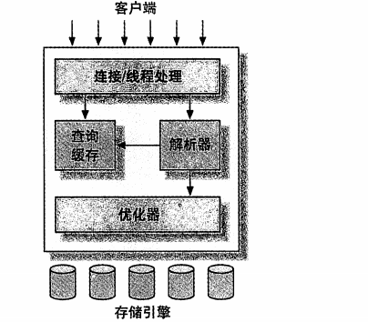

<h1>MYSQL架构</h1>
MySQL架构图

客户端就是使用MySQL的客户端

大部分MySQL的核心服务都在第二层，包括查询解析、分析、优化、缓存及所有的内置函数，所有的存储引擎功能都在此实现，包括存储引擎、触发器、视图等。

第三层包含了存储引擎，存储引擎负责数据的存储和提取，包含几十个底层函数，用于执行“开始一个事务”或“根据主键查询一条记录”等。存储引擎不会去解析SQL，不同存储引擎之间也不会相互通信，只是简单的响应上层服务器的请求。
<h2>连接管理</h2>
每个客户端都会在服务器进程中有一个线程，这个连接的查询只会在这个单独的线程中执行，服务器会缓存线程，因此不需要为每一个链接创建或者销毁线程。
<h2>优化执行</h2>
MySQL会解析查询，并创建内部数据结构，然后对其进行各种优化，包括重写查询、决定表的读取顺序以及选择合适的索引等。
<h2>并发控制</h2>
1. 读写锁  
    读锁是共享的，多个客户端可以同时读取互不影响，写锁是排他的，写锁会阻塞其他的写锁和读锁
2. 锁粒度
    锁粒度就是在锁的开销和数据的安全性之间追求平衡，MySQL提供了两种锁粒度以供选择：表锁和行级锁。
   1. 表锁：是MySQL最基本的锁策略，并且是开销最小的策略。表锁会锁定整张表，在特定场景下，表锁也有良好的性能。
   2. 行级锁：行级锁可以最大程度的支持并发处理（但同时锁开销也是最大），行级锁只在存储引擎层实现。

<h2>事务</h2>
事务具有：原子性、一致性、隔离性和持久性
1. 原子性：一个事务必须被视为一个不可分割的最小工作单元，整个事务中的所有操作要么全部成功，要么全部失败，不能只执行一部分。
2. 一致性：数据库总是从一个一致性的状态转到另一个一致性的状态。
3. 隔离性：一个事务提交之前，对其他事务来说是不可见的
4. 持久性:一旦事务提交、则其所作的修改就会永久保存在数据库中。

<h3>隔离级别</h3>
SQL标准中定义了4种隔离级别，每一种都规定了一个事务中所作的修改，在哪些事务内和事务间是可见的。
SQL中共定义了四种隔离级别。
1. READ UNCOMMITTED(未提交读)

                 

                 
